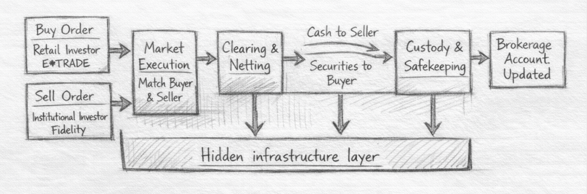

# BNY AI Reinvention

## Consolidated Manuscript: Chapters 1-19

- Included draft set: CH01 draft_v3; CH02 draft_v3; CH03 draft_v5; CH04 draft_v2; CH05 draft_v3; CH06 draft_v2; CH07 draft_v2; CH08 draft_v2; CH09 draft_v2; CH10 draft_v2; CH11 draft_v2; CH12 draft_v1; CH13 draft_v2; CH14 draft_v2; CH15 draft_v2; CH16 draft_v2; CH17 draft_v2; CH18 draft_v2; CH19 draft_v1.

## Contents

- Part I: CH01, CH02, CH03, CH04
- Part II: CH05, CH06, CH07, CH08, CH09, CH10, CH11
- Part III: CH12, CH13, CH14
- Part IV: CH15, CH16, CH17, CH18
- Part V: CH19

## Part I: The Invisible System Beneath Finance

# The Bank You Don't See

Most readers can name the visible giants of finance. They can picture the consumer bank with branches on every corner, the investment bank that dominates headlines, or the asset manager whose market calls fill television panels. BNY rarely enters that mental picture. It does not dominate public imagination in the same way. It does not sit at the center of popular narratives about Wall Street power. And yet it belongs in the conversation about the institutions global finance depends on for core infrastructure functions.

That contrast is the real place to start. BNY is easy to overlook precisely because it operates beneath the level most people see. Its role is not primarily to own the customer relationship at the visible edge of finance. Its role is to help the system itself operate: to safeguard assets, support settlement, move money, service funds, and sit inside the infrastructure that allows markets to keep working.^[SRC-002] In practical terms, this makes BNY less publicly legible than firms whose businesses are built around lending, trading, or consumer presence. It also makes the firm far more important than its relative invisibility suggests.^[SRC-006]^[SRC-012]

A more defensible claim is that BNY sits in a very small group of institutions whose importance comes from infrastructure, not spectacle. The firm is one of the eight U.S. global systemically important banks, a designation reserved for institutions whose distress would matter far beyond their own shareholders or customers.^[SRC-005] It reported $59.3 trillion in assets under custody and/or administration at the end of 2025, alongside $2.2 trillion in assets under management, and says it serves nearly all of the top 100 banks globally.^[SRC-003] Those are not the metrics of a niche specialist. They are the metrics of a firm embedded deeply enough in the financial system that its significance is easier to underestimate than to exaggerate.

Peer comparison sharpens the point. State Street's investment-services business reported $53.8 trillion in assets under custody and/or administration in 2025.^[SRC-007] J.P. Morgan's securities-services business says it holds more than $32 trillion in assets under custody and settles roughly $1 trillion of securities daily across more than 100 markets.^[SRC-008] The point of these comparisons is not that BNY is alone. It is that BNY belongs to the narrow layer of institutions that operate as market infrastructure at enormous scale. What makes BNY especially interesting is not just size, but concentration across functions that sit close to the core of financial coordination: custody, collateral, servicing, cash movement, and settlement-adjacent activity. The firm is not merely a large participant in finance. It is embedded in the workflows that allow many other financial institutions to function.

That distinction matters because the most consequential layer of finance is often the least visible one. An investment decision may get attention. A trade may appear to complete instantly. But underneath that visible moment sits a quieter requirement: assets have to be safeguarded, obligations have to be settled, cash has to move, records have to hold, and institutional trust has to be maintained at scale. BNY matters because it is embedded in that layer. It describes itself as the world's leading custodian and collateral manager and the primary settlement agent for U.S. government securities.^[SRC-001] Those facts justify strong language about systemic importance without needing to overstate the claim.

This is also why BNY can seem oddly absent from mainstream financial narratives. The firm does not become most legible at the moment of market drama. It becomes most legible when the reader asks a different question: what has to happen after the visible event for finance to become durable reality? That is the level where BNY sits. The company is easier to miss if you look for the edge of finance. It becomes much harder to miss if you look for the layer that allows the rest of the system to keep functioning.

That hiddenness is not a branding problem. It is a clue about what kind of institution BNY is. The firm sits below the level of headline finance and closer to the layer where assets are safeguarded, obligations are settled, and institutional trust is operationalized. That makes it a strange subject for a book only if we still think the future of finance will be decided mainly by the most visible firms. If instead we think the next shift will come from the institutions that already run the substrate of the system, BNY becomes one of the most strategically important companies in global finance.

That is the bridge to the rest of this book. The next chapter steps back from BNY as a company and shows the broader machine in which firms like BNY sit: the connected asset flows, handoffs, and operating layers that most strategic discussions ignore. The chapter after that follows a single trade through that machine so the hidden infrastructure becomes tangible rather than abstract. Only then do the deeper implications of BNY's position come fully into view.

Before asking how AI could change BNY, we first need to see the company for what it already is: not just another bank, but a piece of financial infrastructure with unusual scale, unusual embeddedness, and an unusual opportunity to become more than a servicer. That is why this book starts here.

# The Global Asset Machine

Most people think about finance through institutions. They picture a bank, an asset manager, a broker, an exchange. They imagine firms facing customers, taking risk, making markets, or managing money. That is a natural way to see the system, but it is not the most useful one for this book. If Chapter 1 introduced BNY as a company that matters more than most outsiders realize, this chapter explains why: the most important layer of finance is not just made of institutions. It is made of flows.

Capital moves through a machine. An investment decision is made. A trade is executed. Cash must move. Securities must settle. Ownership must be recorded. Assets must be safeguarded. Funds must be accounted for. Investors must be serviced. Reports must be generated. Collateral must be mobilized. Liquidity must be available when the system needs it. By the time an asset reaches a stable resting place on a balance sheet or in a portfolio report, it has usually passed through more operational layers than most strategic discussions ever acknowledge.^[SRC-002]^[SRC-003]^[SRC-004]

That is the first shift the reader needs to make. Finance is not only a market of products. It is a machine for moving, validating, financing, safeguarding, administering, and reporting on assets and cash. Seen from that angle, categories that often appear separate in corporate org charts start to look inseparable in practice. Settlement is not meaningful without cash movement. Custody is not meaningful without accurate records and safekeeping. Fund administration is not meaningful without data, accounting, and investor reporting. Collateral and liquidity are not side topics. They are what allow the machine to keep operating under real constraints.

This matters strategically, not just descriptively. A firm embedded in one product can improve a product. A firm embedded across the handoffs between products can influence how the system itself runs. That is the real leverage hidden inside financial infrastructure. The institution that sits across execution's aftermath, settlement, custody, servicing, collateral, and cash movement is in a position to see more, coordinate more, and eventually optimize more than a firm confined to one visible slice of the market.

This is why the line between "front office" and "back office" is so misleading. It encourages the reader to imagine value being created at the moment of decision and merely processed afterward by lower-order functions. In reality, a transaction that cannot settle cleanly, an asset that cannot be reconciled confidently, a fund that cannot be valued accurately, or a payment flow that cannot move on time is not a small operational nuisance. It is a breakdown in the chain that turns financial intention into financial reality. The visible moment of finance may be the trade. The durable reality of finance is the system that makes the trade stand up afterward.^[SRC-012]

The easiest way to see that machine is to break it into linked layers:

| Layer | What happens here | Why it matters |
| --- | --- | --- |
| Execution | An institution decides to buy, sell, lend, borrow, allocate, hedge, or transfer an asset. | This is where financial intent begins, but not where it becomes durable reality. |
| Post-trade completion | Trades are confirmed, cleared, and settled; obligations are matched; securities and cash change hands.^[SRC-002]^[SRC-003] | This is where market intent becomes completed transaction reality. |
| Safekeeping and custody | Ownership is protected, positions are maintained, and assets are held in a controlled operational environment.^[SRC-007] | Without this layer, completed transactions would still lack durable operational trust. |
| Servicing and administration | Funds are accounted for, books and records are updated, investors are serviced, and reports are generated.^[SRC-005]^[SRC-013] | This is how assets remain legible, governable, and usable over time. |
| Liquidity, payments, and collateral | Cash moves, financing conditions are maintained, and collateral is mobilized to support the system.^[SRC-006]^[SRC-009] | These functions keep the rest of the machine from stalling under real funding and exposure constraints. |

These layers may sit in different business units, but they do not behave like separate realities. They behave like one connected operating system for assets.

One missed handoff is enough to reveal how connected the machine really is. Imagine a large institutional trade that executes normally but then hits a settlement exception because cash, securities, or reference data do not align cleanly. The problem does not stay neatly inside "operations." The position may be unclearly recorded. Funding assumptions may no longer match reality. Reconciliation work expands. Reporting becomes less trustworthy until the break is resolved. What looked like one broken step turns into a chain of uncertainty across ownership, liquidity, books and records, and client-facing confidence. That is what people miss when they think of these functions as separate back-office boxes. The machine fails as a system, not as a slide title.

Once the machine is described this way, BNY's place inside it becomes much easier to see. The firm does not just appear at one narrow point in the chain. Its own descriptions of the business repeatedly emphasize breadth across the lifecycle: creating, administering, managing, transacting, distributing, and optimizing assets; integrated clearing and custody across the post-trade lifecycle; fund accounting, administration, investor services, and data; global payments and trade; collateral management; and lifecycle support across the investment journey.^[SRC-001]^[SRC-007]^[SRC-008]^[SRC-013]^[SRC-014] This is why BNY can look oddly diffuse if the reader thinks only in terms of product categories. The company makes more sense when seen as a participant across the machine rather than as a single product franchise.

That distinction matters because it changes where strategic leverage appears. A firm that owns one product can optimize a product. A firm embedded across multiple stages of a workflow can influence how the workflow itself operates. BNY's opportunity is not just that it is large in custody, significant in payments, meaningful in servicing, or important in collateral. It is that these positions sit close enough to one another that they can eventually be understood as components of a broader platform. The source of leverage is not simply scale. It is adjacency across the lifecycle.

This is also why the chapter needs to linger on servicing rather than stopping at settlement. Many explanations of market structure become too narrow too quickly. They focus on the completion of a trade and ignore what happens after the asset is booked. But administration is part of the machine, not an afterthought. Fund accounting, reporting, investor services, oversight, and related operating tasks are how financial positions remain legible over time.^[SRC-005]^[SRC-013]^[SRC-014] A system that can execute transactions but cannot continuously administer, explain, and report on them is not a complete system. It is only the beginning of one.

The same logic applies to liquidity and collateral. These functions can sound technical or peripheral until the reader asks what actually keeps institutions able to fund positions, manage exposures, and move through periods of market stress. BNY describes collateral mobility and optimization as connected platform capabilities, not isolated products.^[SRC-009] That framing is useful here because it reinforces the central point of the chapter: the machine is not just a trade lifecycle. It is the connected infrastructure that lets assets, cash, obligations, and records remain aligned over time.

There is a reason BNY often describes itself in lifecycle terms. The company says it helps clients across every stage of the financial lifecycle and touches approximately 20 percent of the world's investable assets.^[SRC-010] Those phrases would be easy to dismiss as corporate branding if they were not supported by the underlying shape of the business. But in this case the branding points toward a real structural truth. BNY is not just in financial services. It is positioned across multiple layers of the machine that makes financial services possible.

That does not mean every part of the machine belongs in this chapter at full depth. A later chapter will follow a trade more concretely from end to end. Later still, the book will break down the major business lines one by one. The goal here is different. The goal is to give the reader a mental model that is durable enough to support everything that follows. Before asking whether BNY can become an intelligent platform, the reader has to see why the firm already resembles an operating system for assets, cash, records, and coordination.

That is the key reframe. The system beneath finance is not just a collection of institutions. It is a connected asset machine. And BNY matters because it sits inside more of that machine than most readers initially realize.

# A Day in the Life of a Trade

The easiest way to understand the hidden machine beneath finance is to stop talking about the system in the abstract and follow one transaction all the way through it. Start with something familiar. Imagine, for illustration, that you open E*TRADE and decide to buy 100 shares of a public company while, somewhere else, another investor or fund sells those shares through another broker, say Fidelity Institutional. The order is placed. The trade is executed. From your point of view, the event can feel almost complete as soon as it begins. You clicked buy. A seller existed. The market matched the trade. A position appears on a screen.

But execution is only the visible beginning.

*Figure: Simplified walkthrough of one stock purchase. The figure is conceptual rather than literal. It is meant to show that execution is only the visible beginning, while clearing, settlement, custody, and record-keeping happen in deeper institutional layers.*

What happens next is the part most people never see. The trade has to move from market intent into completed financial reality. That means the institutions behind the scenes have to confirm the trade, clear it, settle it, record it, safeguard the asset, and maintain the information that proves ownership over time.^[SRC-001]^[SRC-002] If any of those steps fail, the transaction is no longer just a trade idea that happened in the market. It becomes a problem for cash, records, counterparties, and trust.

The first important distinction is between execution and settlement. Execution is the moment the buyer and seller agree to the trade in the market. Settlement is the moment the securities are officially delivered to the buyer and the cash is officially delivered to the seller.^[SRC-002] That gap matters. It is one of the clearest examples of how finance differs from the simplified mental model many people carry around. A trade can be executed immediately, but it still takes infrastructure to make the transaction complete.

Return to the E*TRADE example. Your order is routed through your broker into the market. Another broker represents the seller. Once the trade is executed, the obligation created by that match still has to be processed through the post-trade system. Clearing institutions step in to compare, match, net, and manage the obligations created by the transaction.^[SRC-003]^[SRC-004] In U.S. equities, the National Securities Clearing Corporation, or NSCC, plays a central role in clearing and netting, reducing large numbers of bilateral obligations into more manageable net positions before completion.^[SRC-004]^[SRC-005] NSCC is part of DTCC, the Depository Trust & Clearing Corporation, which sits at the center of key U.S. post-trade market infrastructure through services that support clearing, settlement, depository functions, and related recordkeeping.^[SRC-003]^[SRC-004]^[SRC-005] What looked like one clean trade from the outside is, in practice, one event being translated into a system that the market can actually absorb.

Settlement is where the system has to prove that it can finish what the market started. Cash and securities have to move. Ownership has to be reflected correctly. The transaction has to become durable, not just agreed.^[SRC-002]^[SRC-005] This is the moment where the hidden machine begins to matter more than the visible trade itself. A market can generate endless transactions, but if the infrastructure beneath it cannot complete them reliably, the market's apparent fluidity is an illusion.

Where is the stock after settlement? Not in the intuitive sense most retail investors imagine. You do not typically receive a paper certificate, and the shares are not sitting in some simple digital envelope labeled only with your name. Instead, ownership is maintained through a layered custody and record-keeping system. Your broker reflects the position in your account. The underlying securities position is held through institutional custody and depository infrastructure. Records, statements, and ownership proofs are what make that position durable and reviewable from your perspective.^[SRC-010]^[SRC-011]^[SRC-012]

This is where custody and safekeeping become central, and it is also where firms like BNY become easier to see. Custody is not just a vault-like concept. As the Office of the Comptroller of the Currency describes it, custody services typically include settlement, safekeeping, and reporting of customers' securities and cash.^[SRC-010] In many regulated structures, custody is also a rule-bound function: advisers with custody generally must maintain client assets with a qualified custodian, and registered funds must maintain assets with permitted custodians under prescribed conditions.^[SRC-013]^[SRC-014] That does not mean every asset in every structure follows one identical rule, but it does show why custody sits so close to trust and control. The trade is not really "done" when settlement happens. It has to be held, reflected in positions, tracked in records, and made legible to the institutions that now own or administer the asset. BNY's custody and settlement businesses sit inside exactly this layer of the chain.^[SRC-006]^[SRC-008]

In the E*TRADE example, BNY is not the app you opened or the broker relationship you see directly. BNY is most visible in the post-trade and servicing layers, especially custody, settlement support, safekeeping, records, and reporting, even though some BNY businesses also participate in execution and clearing-related services for specific client segments.^[SRC-006]^[SRC-007] Its importance appears lower in the stack, in the infrastructure that helps turn a matched trade into a settled, safeguarded, and reportable position. That does not mean every retail trade lands directly at BNY in the same simple way. It means BNY operates in the layer that helps make this kind of trade real and keep it real over time.

This is also where the transaction becomes real in your own world. You see a position in an account. A statement later reflects ownership. Records persist. Proof of ownership becomes something that can be documented, transferred, or audited if necessary.^[SRC-011]^[SRC-012] None of that is glamorous. But it is the part that turns a market event into a durable financial fact. Without it, buying a stock would be little more than a temporary agreement floating above an unreliable record system.

Even a light touch on failure makes the point. If cash, securities, or records do not align cleanly at the right moment, the problem does not stay confined to one narrow operational team. The trade may not settle as expected. Ownership records may become harder to reconcile. Reporting can become less trustworthy until the break is resolved. This chapter does not need to become a catalog of settlement fails or exception management. Later chapters will carry more of that load. But even here, the important thing for the reader to see is that the machine matters because breaks propagate across it, not because each individual function sounds complicated.

Once the walkthrough is viewed this way, BNY's role becomes much clearer. The firm is not just "some bank in the middle." It sits in the layer that helps convert transactions into settled, safeguarded, recorded, and reportable reality. Its own descriptions emphasize safekeeping, transactions, settlement, reconciliations, reporting, and support across the financial lifecycle.^[SRC-006]^[SRC-007] The strategic point follows naturally. If you sit where trades become durable reality, you occupy a more consequential position than public visibility alone would suggest.

That is what a single securities purchase reveals. The trade the investor thinks they made is only the surface event. Beneath it sits a connected chain of brokers, clearing infrastructure, settlement machinery, custody, reporting, and record-keeping. The market may create the transaction. The machine is what makes it real. And BNY matters because it lives inside that machine.

# Why This Model Works

By the end of the first three chapters, the reader has seen three parts of the same picture. Chapter 1 argued that BNY matters more than its public visibility suggests. Chapter 2 showed that finance works through a connected asset machine rather than isolated products. Chapter 3 made that machine tangible through a single trade. The next question is the strategic one: why does a company embedded in this layer of finance hold such a durable position in the first place?

The answer starts with a distinction the market often misses. Visible financial franchises can be powerful, but they are not always the most durable. Consumer brands can be attacked. Trading revenues can swing. Product advantages can narrow. Infrastructure businesses are different. When a firm sits inside the functions that safeguard assets, support settlement, maintain records, move cash, and help clients operate with continuity, its value is not based mainly on attention. It is based on trust, reliability, and the cost of disruption.

That is the first reason this model works. In infrastructure, continuity is part of the product. A custodian or servicing provider is not simply selling a feature set. It is taking responsibility for safekeeping, settlement support, reporting, records, and the stable operation of critical workflows over time.^[SRC-004] That creates a different kind of commercial relationship from the one investors usually associate with more visible banking or asset-management businesses. The client is not only choosing a provider. The client is choosing where to place operational trust.

That trust becomes more valuable, not less, as scale increases. BNY's own materials describe a market in which clients are consolidating providers in order to reduce operational risk, improve resiliency, and simplify accountability across complex workflows.^[SRC-001] That is a revealing statement. It suggests that in this part of finance, scale is not merely a bragging right. Scale can itself be a form of risk reduction. The more a provider can deliver trusted continuity across multiple connected functions, the more attractive it becomes to clients trying to reduce the fragility created by fragmented handoffs.

This helps explain why infrastructure relationships can become unusually sticky. The switching cost is not just contractual. It is operational. Replacing a deeply embedded provider means touching workflows, records, controls, reporting routines, service models, data dependencies, oversight processes, and client expectations that have accumulated over time. Even when the economics of a relationship are debated, the cost of disruption remains high. In this layer of finance, migration is never just a commercial decision. It is also a trust, governance, and continuity decision.

Imagine what that means in practice for a large institutional client. Moving away from an embedded provider is not like changing one software tool or renegotiating a single product contract. It means reworking how positions are recorded, how reconciliations are performed, how client and investor reports are produced, how controls are evidenced, how operational exceptions are managed, and how oversight teams gain confidence that the new environment is actually behaving as intended. Even if the destination provider is credible, the transition itself introduces risk. That is why stickiness in this layer should not be confused with mere inertia. Clients often stay because the operating cost of getting continuity wrong is high.^[SRC-001]^[SRC-004]

That point is especially important for BNY because the firm's durability does not come from one isolated product franchise. It comes from adjacency across the lifecycle. BNY describes itself as operating across the creation, servicing, movement, safekeeping, and optimization of assets.^[SRC-002] Its annual report goes further, emphasizing differentiated end-to-end offerings that clients value precisely because they reduce handoffs and are difficult to replicate.^[SRC-001] This is the deeper moat. A narrow provider can be replaced function by function. A provider sitting across multiple handoffs is harder to displace because removing it creates more coordinated change, more institutional risk, and more execution burden.

This is also why trust and embeddedness reinforce one another. A provider becomes trusted because it performs reliably in critical workflows. It becomes harder to replace because those workflows continue to accumulate around it. Over time, the relationship stops looking like a simple vendor choice and starts looking more like part of the client's operating environment. That does not make the position permanent. It does mean that competitive pressure has to overcome more than pricing or branding. It has to overcome operational depth.

Regulation adds another layer to this durability, but it has to be framed carefully. Regulation is not simply a moat. It is also a cost, a burden, and a source of constraint. But in continuity-sensitive businesses, regulation also increases the premium on providers that can operate at scale with trust, resilience, and supervisory credibility. BNY's status as a global systemically important bank matters in this chapter not because it proves commercial superiority, but because it reinforces the point that this company sits inside functions where failure tolerance is low and continuity requirements are high.^[SRC-003]

The same logic appears across market infrastructure more broadly. Organizations such as DTCC emphasize resilience, risk reduction, secure operation, and standardization as core sources of value in post-trade infrastructure.^[SRC-006]^[SRC-007] BNY is not the same kind of institution as DTCC, but the market logic overlaps. In infrastructure businesses, resilience is not a side virtue. It is part of the competitive proposition. The provider that reduces operational uncertainty can become more deeply embedded than the provider with the louder public profile.

This is why BNY should not be understood as a legacy institution drifting forward on inertia. It is better understood as a structurally advantaged operator. The firm's role is durable because it sits where records, trust, continuity, and operational coordination matter every day, not just in moments of market drama. Its scale reinforces that position. Its breadth across the lifecycle compounds it. And its embeddedness makes displacement slower, riskier, and more expensive than a superficial view of the business would suggest.

That durability matters for the rest of this book because it changes how transformation should be understood. BNY is not trying to reinvent itself from a position of weakness. It is trying to extend a model that already works. The strategic opportunity is not to abandon infrastructure for something more fashionable. It is to turn embedded infrastructure into a more intelligent platform. Before the book can ask how AI changes that equation, it needs to establish that the current model has real strength. This chapter is that argument.

## Part II: The Operating Businesses Beneath the Brand

# Asset Servicing (Custody and Fund Accounting)

If Chapter 6 is about how a trade becomes completed in the market's post-trade infrastructure, this chapter is about what happens after assets and funds already exist and must be kept governable every day. Asset servicing begins once positions, cash balances, fund structures, and investor records have to be maintained over time rather than merely completed at trade date. That means custody, accounting, valuation, reporting, investor servicing, transfer activity, corporate-actions processing, and the control fabric needed to keep all of those layers aligned over time.^[SRC-001]^[SRC-002]^[SRC-003]

That is why asset servicing is not just an appendage to clearing and settlement. Clearing and settlement answer the question, "did the trade complete?" Asset servicing answers the question, "can the resulting positions, cash, entitlements, books, and investor records still be trusted tomorrow, next week, and at quarter-end?" That is why this business matters so much to BNY. It is not peripheral to the franchise. It is one of the franchise's main engines. The firm describes its Securities Services and fund-services capabilities as integrated operating models rather than as isolated products, and that is the right way to understand them.^[SRC-001]^[SRC-004] Clients are not simply outsourcing one task. They are deciding where books and records will be maintained, where post-trade activity will be stabilized, where reporting and control evidence will be produced, and where a large amount of day-to-day operating trust will sit.

From a practitioner's perspective, the useful question is not "what products are in the stack?" It is "what has to happen every day for the stack to remain believable?" Assets have to settle. Positions have to stay aligned across records. Prices have to feed the books correctly. NAVs have to be produced on time. Exceptions have to be triaged. Corporate events have to be interpreted and applied. Investor records have to reflect subscriptions, redemptions, and transfers. Reports have to reconcile to the books. Audit trails have to exist. That is the real shape of the business. It is a recurring control-and-coordination business disguised by calm client-facing language.

This is also why the economics are durable. Asset servicing revenue is attached to tasks clients must keep performing whether markets are exciting or dull. Funds still need NAVs. Custody chains still need oversight. Investor accounts still need servicing. Boards, regulators, auditors, and clients still expect accurate reports and explainable records. In important regulated pools such as adviser-managed client assets and registered funds, custody is also governed by rules that generally require assets to be maintained with qualified or otherwise permitted custodians under prescribed conditions.^[SRC-022]^[SRC-023] The service becomes hard to replace not because the contract is exotic, but because the process footprint is broad and because a provider's failure would show up immediately in operations.^[SRC-003]^[SRC-004] Continuity is part of the product.

The best way to understand the business, then, is layer by layer.

| Layer | What the layer does | Typical supporting processes | Where friction tends to show up |
| --- | --- | --- | --- |
| Custody and settlement support | Keeps positions and cash moving into settled, safeguarded status | Instructions, matching, settlement monitoring, sub-custodian coordination, reconciliations, reporting | Failed settlements, stale status, reference-data mismatches, position and cash breaks |
| Books and records | Maintains the official and operational accounting views of holdings and cash | Ledger maintenance, classification, tax lots, accruals, audit trails, reconciliations | Timing mismatches, ledger breaks, late adjustments, cross-system inconsistencies |
| Pricing, valuation, and NAV | Converts positions and balances into usable fund values and per-share outputs | Price ingestion, valuation controls, expense accruals, NAV oversight, distribution-rate updates | Stale prices, missing inputs, accrual errors, unresolved breaks surfacing in NAV |
| Administration and reporting | Turns operating records into official reports, control evidence, and governance outputs | Financial reporting, regulatory reporting, tax support, oversight packages, control review | Reporting exceptions, unresolved upstream issues, evidence gaps, governance pressure |
| Investor servicing and transfer agency | Maintains investor accounts and transaction flows around subscriptions, redemptions, and transfers | Account administration, dealer servicing, omnibus data exchange, confirmations, re-registration | Transfer delays, account-mapping issues, intermediary coordination problems, visibility gaps |
| Corporate actions and distributions | Applies market events and fund distributions to records, entitlements, and instructions | Event ingestion, entitlement calculation, elections, allocations, posting, reporting | Event ambiguity, missed elections, allocation issues, holding-location uncertainty |
| Reconciliation and exception management | Keeps the whole process stack believable when differences appear | Break detection, queue management, dashboards, workflow routing, review and signoff | Accumulated small breaks, manual reviews, repeat exceptions, delayed resolution |

## Custody And Settlement Support

The first layer is custody. In plain language, custody includes safekeeping securities and cash, settling transactions, and providing reporting around those holdings.^[SRC-003] In live operations, though, a custodian is doing much more than holding assets in place. BNY's custody materials describe an active platform that supports trade processing, settlement activity, reconciliations, local-market connectivity, reporting, dashboard visibility, and sub-custodian oversight across global markets.^[SRC-005]^[SRC-008]^[SRC-016]

That operating posture matters. A global custodian sits in the middle of instructions, counterparties, market cutoffs, local conventions, and the daily status changes of large volumes of positions and cash. Trades do not simply appear in a final state. They are instructed, matched, settled, sometimes delayed, sometimes corrected, and then reflected through downstream records and reports. A custodian's job is to keep that chain moving while preserving confidence that the official record remains right enough to govern from. Reporting is therefore not an afterthought. It is one of the mechanisms by which the client remains able to supervise the position and cash picture it has delegated to someone else.

At a practical level, an instruction is simply the operational message that tells the system what has to move, between which accounts, against which counterparty, on which date, and under what settlement conditions. A simplified instruction might look like this:

| Field | Illustrative value |
| --- | --- |
| Instruction type | Receive versus deliver |
| Account | Fund account or custody account identifier |
| Security | ISIN, CUSIP, or other security identifier |
| Quantity | Number of shares or face amount |
| Counterparty or agent | Broker, custodian, or settlement agent |
| Settlement date | Contractual date for completion |
| Cash amount and currency | Amount to be paid or received |
| Settlement location | Market, depository, or local settlement venue |

If one of those fields is missing, stale, or inconsistent with standing settlement instructions, account setup, market convention, or counterparty records, the problem usually reappears downstream as a failed settlement, a reconciliation item, or an exception queue rather than as one cleanly isolated error.

The supporting processes under this layer are where a practitioner begins to see the real friction points. Settlement support depends on timely instructions, reference-data quality, local-market knowledge, and coordination with sub-custodians and counterparties. Position and cash breaks can emerge from timing mismatches, failed settlements, market claims, stale status messages, or data that lands differently in different ledgers. The public sources do not give BNY's internal exception taxonomy, but they make clear that the custody layer is built around continuous monitoring, reconciliation, and operational oversight rather than around static storage.^[SRC-005]^[SRC-008]^[SRC-018]

That local-market knowledge is not a soft advantage. It is operating knowledge about how completion actually works in each market. Settlement cycles differ. Cutoff times, holidays, depositories, and account structures differ. Tax documentation, beneficial-ownership conventions, corporate-action handling, and acceptable instruction formats differ. A process that settles cleanly in one market can fail in another because the local settlement venue, agent model, documentation requirement, or market convention is different. That is why global custody is not just custody done at larger scale. It is a coordination business carried across many local operating environments at once.

This is the first place where the chapter's "strong business, messy internals" framing becomes visible. Custody can look stable to the client precisely because a large amount of control work has already been applied underneath. The provider absorbs timing pressure, market complexity, and record-alignment effort before the client sees the output.

## Books And Records

The second layer is the books-and-records substrate, which is often flattened into the phrase fund accounting but is better understood as the operating memory of the business. Someone has to maintain the positions, cash balances, tax lots, classifications, and accounting views that later feed valuation, reporting, oversight, and client servicing. BNY's accounting-solutions material is helpful here because it describes a unified accounting environment with multiple bases of accounting, multiple currencies, audit trails, dashboards, and automated oversight capabilities.^[SRC-017]

That matters because the records used to govern a fund are rarely as simple as one official number in one place. Different stakeholders need different views. There is the accounting basis required for official books, but there are also operational views required for intraday monitoring, oversight, exception detection, and reporting. In practice, the challenge is not only recording activity. It is keeping multiple legitimate views of the same portfolio aligned enough that downstream processes can trust them. That is why unified-ledger and audit-trail language matters. It points to one of the business's deepest recurring tasks: preserving a credible chain from transaction activity to books, from books to valuations, and from valuations to external outputs.

This is also one of the quietest sources of friction. Trade events, market events, fees, expenses, cash movements, and reference-data updates do not all arrive in neat sequence. They often land through different channels, on different clocks, and with different levels of confidence. A trade may settle in custody while the accounting record is still waiting for the correct event file, tax-lot assignment, or cash detail. A corporate-action update may change position quantities while an expense accrual or income posting is still sitting in a separate workflow. Before valuation can begin, those items have to land coherently enough that the official books, the operational view, and the supporting cash record are telling the same story. That means books-and-records maintenance is never just bookkeeping. It is a control discipline that has to absorb late inputs, breaks between systems, classification issues, and reconciliation findings without undermining the official record.

## Pricing, Valuation, And NAV Production

The third layer is pricing and valuation, which is where fund accounting becomes visible to the outside world. NAV, or net asset value, is the per-share value of a fund after its holdings are priced, cash and accrual balances are updated, liabilities are recognized, and the result is allocated across the fund's shares. In many traditional fund structures, that is calculated on a regular valuation cycle, often at the end of the trading day, rather than as a continuously refreshed number. BNY's fund-accounting material emphasizes ongoing valuation cycles, NAV oversight, reporting discipline, and the ability to run the process repeatedly at scale across large numbers of funds and share classes.^[SRC-006] That is directionally important, but the process picture gets clearer when paired with DTCC's pricing and distribution-data material. Daily NAVs, dividend rates, and distribution schedules have to be standardized and disseminated accurately across operational channels because downstream participants are relying on those values to process activity correctly.^[SRC-021]

In other words, NAV production is not one calculation at the end of the day. It is the visible output of an upstream assembly line. Positions have to be right. Prices or evaluated values have to be available. Cash and accrual balances have to be current. Fees and expenses have to be applied correctly. Corporate-action effects have to be reflected. Controls have to distinguish between expected movement and unexplained movement. If any one of those layers is unstable, the pressure often shows up in the valuation process because NAV is where many of the upstream errors become intolerable.

This makes valuation one of the clearest points at which practitioners can infer friction. When firms invest in automated NAV oversight, dashboards, contingency tooling, and standardized workflows, they are signaling that the process is too timing-sensitive and too consequence-heavy to leave to loose coordination.^[SRC-006]^[SRC-017] The public sources do not expose a detailed NAV-error playbook, but they do make it reasonable to conclude that pricing issues, stale inputs, late exceptions, and unresolved breaks are among the places where operational attention concentrates.

## Fund Administration, Reporting, And Governance

The fourth layer is fund administration, which extends the stack beyond books and calculations into official reporting, regulatory support, tax support, and the broader control environment.^[SRC-002] This is the layer that turns underlying operations into something a board, regulator, auditor, or client can inspect. It is also where operational problems become harder to contain. A break in a transaction record can turn into a valuation question. A valuation question can turn into a reporting risk. A reporting risk can become a governance issue. Administration therefore sits downstream from many processes while also feeding back requirements into how those processes have to be controlled.

This is why administration should not be mistaken for clerical packaging. It is closer to a translation layer between the live operating system of the fund and the official outputs that the outside world relies on. Financial reporting, regulatory reporting, tax workflows, and evidence of controls all depend on the underlying record being stable enough to support them.^[SRC-002]^[SRC-014] If the underlying machinery is noisy, administration becomes the place where that noise has to be resolved, explained, or contained.

From a practitioner's standpoint, one useful inference follows. The servicing provider is not only running processes. It is also carrying responsibility for explaining those processes through reports, evidence, and control artifacts. A small upstream break, such as a misposted cash movement or an unresolved price challenge, may begin as an operations item but can quickly become a board-reporting question, a NAV signoff delay, or a governance issue if it is still open when official outputs have to be produced. That increases the burden on exception management because an unresolved issue is not merely an internal irritation. It is a potential reporting and oversight problem.

## Investor Servicing And Transfer Agency

The fifth layer is investor servicing and transfer agency, which broadens the chapter from institutional asset records to account-level activity. BNY's transfer-agency platform materials describe account administration, dealer servicing, cash control, NAV management support, omnibus recordkeeping, and interfaces into intermediary and brokerage environments.^[SRC-009] Those are not decorative adjacencies. They show that the servicing stack extends into the points where investor activity meets fund administration and cash movement.

This is another area where the supporting processes make the business more operationally dense than it first appears. Subscriptions and redemptions are not just commercial events. They affect cash, records, cutoffs, confirmation flows, and often the speed at which updated account status has to be visible across parties. Account transfers and re-registrations add another layer. DTCC's transaction-processing and transfer materials show how much infrastructure exists simply to standardize these paths and reduce delays, paperwork, and errors.^[SRC-012]^[SRC-013]

The friction points here are easy to infer even from public process descriptions. Transfer work is sensitive to data quality, account mappings, intermediary coordination, and timing windows. Omnibus structures create visibility challenges that have to be handled through data exchange and reconciliation rather than through one transparent ledger. When firms advertise automation and standardization in this part of the market, they are often advertising relief from processes that otherwise become delay-prone, exception-prone, and labor-intensive.^[SRC-009]^[SRC-011]^[SRC-012]

## Corporate Actions And Distributions

The sixth layer is corporate actions and distributions, one of the clearest sub-processes in the entire servicing stack because it makes exception handling unavoidable. Corporate actions are events initiated by an issuer or fund that change what holders are entitled to receive or what has to happen to the security or fund position next. Common examples include cash dividends, stock splits, tender offers, mergers, rights issues, fund distributions, and proxy or reorganization events.^[SRC-019]^[SRC-020] They are not a side process that happens occasionally. They are part of how securities and funds keep changing state over time. DTCC's corporate-actions materials make the workflow explicit: events have to be announced, interpreted, linked to holdings, turned into entitlements, paired with instructions where elections are needed, collected, allocated, and then reported back out.^[SRC-019]^[SRC-020]

This is exactly the kind of process that looks simple only from a distance. Mandatory events still require timely and accurate event ingestion, position determination, entitlement calculation, and posting. Voluntary and reorganization events add instruction deadlines, election processing, allocation logic, and the possibility that holdings, counterparties, or locations of inventory may not be perfectly clear at the moment they matter most.^[SRC-020] If a practitioner wants to know where some of the ugliest exception queues live in asset servicing, this is one of the first places to look.

Why does this matter so much? Because a corporate action is one of the moments when the system has to prove it knows who owns what, where the position sits, which account is entitled, whether an election is required, what deadline applies, and how the result should flow into cash, positions, books, and reports. A cash dividend changes entitlements and cash postings. A stock split changes position quantities and often tax-lot handling. A tender offer or merger can require holder elections, cutoff management, allocation logic, and updates to downstream records once the event is completed. In each case, the process is only as reliable as the underlying position data, account mappings, local-market handling, and instruction routing.

The importance of this layer is not only that it is complex. It is that it links many other layers together. Corporate actions can affect positions, cash, entitlements, accounting entries, prices, distributions, investor records, and reporting. They therefore serve as a kind of stress test for the entire servicing stack. If records are out of sync, if holding locations are unclear, if instruction handling is weak, or if event data is ambiguous, the corporate-actions process surfaces that weakness quickly.

## The Reconciliation And Exception-Management Fabric

Once all of these layers are visible, the most important conclusion is that asset servicing is not really a stack of isolated workflows. It is a set of interdependent processes held together by a control fabric. Reconciliation is one part of that fabric. Exception queues are another. Audit trails, dashboards, status monitoring, workflow standardization, account-level data exchange, and oversight evidence are all part of the same answer to one question: how does the provider keep a believable operating picture when the underlying business keeps generating differences, timing issues, and special cases?^[SRC-011]^[SRC-013]^[SRC-017]

This is where public sources are particularly revealing. They repeatedly emphasize reduced manual effort, workflow standardization, visibility, dashboarding, straight-through processing, and removal of failure points.^[SRC-001]^[SRC-014]^[SRC-015] That language is easy to read as generic marketing. It is more useful to read it as an indirect map of burden. Firms spend heavily on these capabilities because the natural state of the process stack is not automatic harmony. It is partial alignment that has to be improved continuously.

What do those breaks actually look like in practice? One common example is a position reconciliation break in which the custodian's record shows a settled holding while the fund-accounting ledger is still missing the update because the settlement-status message arrived late or posted differently. Another is a cash break in which an expected dividend or trade-related cash movement appears on the custody side but has not yet been reflected in the accounting view because the event was coded differently or landed in the wrong period. A third is a corporate-action exception in which an election deadline is approaching but the eligible position, account mapping, or holding location is still unclear. Pricing breaks create their own queue when a security lacks a current price, has conflicting vendor prices, or carries an outlier move that requires review before NAV can be finalized.

The handling pattern is usually not mysterious, but it is labor-intensive. The break is detected through reconciliation logic, threshold checks, or exception reports. It is then routed to an operations queue where teams compare source records, review timestamps and event details, contact counterparties or internal support groups where needed, decide which record is authoritative, and either post a correcting entry, update reference data, resend an instruction, or hold the downstream process until the exception is resolved. If the item cannot be cleared quickly, it is typically aged, escalated, and carried on dashboards or signoff reports until someone can explain why the books and the operating picture differ.

That is the practitioner's view of friction in this business. It usually does not begin with one dramatic failure. It begins with timing mismatches, data that lands differently across systems, corporate-action ambiguity, stale prices, status gaps, transfer delays, unclear account visibility, or breaks between books and reports. Each problem may be small in isolation. The operating challenge is that the business runs at a scale where small problems accumulate into queues, reviews, adjustments, and control work. Precision is therefore expensive, and credibility is maintained through repeated intervention even when the client experience appears smooth.

## Why This Business Is Strong

Seen this way, the durability of asset servicing becomes easier to understand. Clients are not simply buying labor. They are buying an operating environment that can absorb complexity while continuing to produce stable outputs. The value is in trust, but trust in this context means something concrete. It means that a provider can carry custody-chain responsibility, maintain official records, produce valuations, support reporting, service investor activity, handle market events, and keep those processes governable under pressure.^[SRC-001]^[SRC-004]

That is why the business can be commercially strong even when the underlying machinery is demanding. It is embedded in recurring workflows. It is difficult to rebuild internally. It becomes riskier to replace as more connected processes accumulate around the provider. The service is sticky because it touches records, controls, reports, and operating rhythm, not just because it holds assets. What looks from the outside like a stable and somewhat dull franchise is, from the inside, a dense coordination business with unusually high trust requirements.

## Why It Matters For The Rest Of The Book

This is exactly what makes asset servicing such an important chapter for the rest of the book. If the current model were weak, the future-state AI chapter would be too easy. But the current model is not weak. It is durable precisely because it has learned how to manage complexity through control layers, process discipline, and accumulated operational knowledge. The opportunity is not to replace a trivial workflow with a smarter one. The opportunity is to redesign a strong but burdened operating model whose friction points are already visible in reconciliations, supporting data flows, event handling, transfer activity, and exception work.

That is the right current-state conclusion. Asset servicing is not just custody. It is not just fund accounting. It is not just reporting. It is a connected operating business whose layers have to keep agreeing with one another day after day. That agreement is what clients are paying for. It is also where much of the hidden cost and hidden opportunity still live.

# Clearing and Settlement

This chapter sits one layer earlier than Chapter 5. Before anyone can service an asset, account for it, value it, or report on it, the market has to agree what was traded, who owes what, how exposures will be managed, and whether cash and securities will actually be delivered. Clearing and settlement are the operating layers that convert a market agreement into a completed financial obligation, a completed exchange of cash and securities, and a record the system can trust.^[SRC-004]^[SRC-008]

That is why this business matters so much. Markets can create matches all day long. Completion quality comes from what follows: obligations are compared, netted where possible, funded, delivered, settled, and recorded correctly.^[SRC-004]^[SRC-005]^[SRC-006] If Chapter 5 is about keeping assets and funds governable over time, this chapter focuses on the completion layer that makes those assets and records usable in the first place.

For a practitioner, the useful question is practical: what must happen between execution and durable completion? Trades are affirmed. Obligations are matched. Exposures are netted. Counterparty and liquidity risk are managed. Securities and cash move through the appropriate institutions on strict timelines. Breaks are detected. Fails are worked. Records reflect completed activity.

The economics are durable for the same reason the workflow is demanding. Clearing and settlement sit inside mandatory market pathways. If a participant wants completed trades, governable exposure, reliable funding, and credible records, these functions are continuous requirements rather than optional services. In many markets, regulated financial market infrastructure also adds formal risk-management obligations and high barriers to replacement.^[SRC-008]^[SRC-009]

A short qualifier matters before going layer by layer. The operating logic below is shared across many products, while timing windows, netting mechanics, and settlement details vary by market and instrument.

| Layer | What the layer does | Typical supporting processes | Where friction tends to show up |
| --- | --- | --- | --- |
| Trade capture and affirmation | Turns executed trades into mutually recognized post-trade instructions | Trade capture, confirmation, enrichment, affirmation, exception routing | Late affirmation, incomplete trade data, mismatched instructions |
| Clearing and netting | Transforms bilateral obligations into more manageable exposures and applies risk controls | Matching, novation or clearinghouse processing, netting, margin or collateral logic, risk monitoring | Unmatched trades, margin pressure, loss of netting benefits, risk escalations |
| Depository and settlement preparation | Prepares securities and cash movement through the relevant infrastructure | Position checks, depository processing, settlement eligibility, inventory and funding coordination | Inventory gaps, funding shortfalls, timing pressure, depository mismatches |
| Settlement completion | Delivers securities and cash and determines whether the trade actually completed on time | Delivery-versus-payment processing, status reporting, fail management, cash movement | Settlement fails, stale status, cutoff misses, unresolved breaks |
| Post-settlement records and control | Turns completed activity into durable books, reports, and supervisory evidence | Reconciliation, record updates, exception aging, reporting, audit evidence | Book-versus-settlement breaks, unresolved fails, downstream reporting pressure |

## Trade Capture And Affirmation

Trade capture and affirmation form the first post-execution control layer. Once a trade executes, both sides need a consistent, processable representation of what happened so downstream clearing and settlement systems can operate without ambiguity.

The core requirement is not only speed. It is usable accuracy under deadline. Trade data must be complete enough, timely enough, and consistent enough for risk, funding, and settlement workflows to run without preventable rework.^[SRC-013]^[SRC-014]

One practical way to read this layer is as a minimum data contract for post-trade processing:

| Data field family | Typical fields captured | Why it matters operationally |
| --- | --- | --- |
| Trade economics | Instrument identifier, side, quantity, price, trade date and time | Establishes what was actually agreed and what must be settled |
| Counterparty context | Buyer and seller legal entities, executing broker, clearing broker | Determines who owes what, who clears, and who receives exceptions |
| Settlement instructions | Intended settlement date, settlement location or depository account, delivery versus payment terms | Routes the trade toward correct settlement rails and completion rules |
| Account and book references | Client account, sub-account, internal book, custody location | Aligns settlement outcomes to books, records, and reporting obligations |
| Status and controls | Affirmation state, exception code, last update time, owner queue | Supports triage, escalation, and aging control before cutoffs |

This section carries more burden than it appears to at first glance. Late affirmation, incomplete fields, or mismatched instructions consume scarce time early in the cycle. Under tighter settlement timelines, that lost time quickly increases fail risk and financing pressure because downstream teams inherit unresolved ambiguity with fewer corrective windows.^[SRC-013]^[SRC-014]

Cross-functional ownership also starts here. Operations teams reconcile and route exceptions, risk teams monitor exposure implications, treasury teams watch funding readiness, and client-service teams coordinate external confirmations when instructions conflict. In other words, affirmation quality determines how much clean operating room every downstream team receives.

## Clearing And Netting

The next layer is clearing, where bilateral agreements become governed exposure sets. Clearing institutions compare and process obligations, and central clearing arrangements can reduce counterparty risk by placing formal risk controls between market participants.^[SRC-004]^[SRC-005]^[SRC-008]

Role clarity helps keep this chapter readable. DTCC operates core shared infrastructure, including entities such as NSCC and DTC, that large parts of the market use to net, clear, and settle trades. BNY typically serves as a major participant and client-facing operator that helps institutions move through that infrastructure while managing adjacent clearing support, financing, custody, and post-trade workflow responsibilities.^[SRC-002]^[SRC-004]^[SRC-005]^[SRC-006]^[SRC-011]

Netting is one of the layer's key economic mechanisms. Large gross obligations are compressed into smaller net positions that are easier to fund, supervise, and complete.^[SRC-005]^[SRC-013]

A simple example makes the point. Imagine one broker has clients who bought 1 million shares of the same stock during the day and other clients who sold 900,000 shares. Gross activity remains real. Netting can reduce the residual obligation to a net buy of 100,000 shares. The resulting exposure set requires less same-day funding and less settlement inventory than gross-by-gross completion.

This is why netting is operationally central rather than administratively nice to have. DTCC's same-day settlement discussion highlights the implication directly: individual real-time settlement without netting requires earlier and larger cash and securities readiness from participants.^[SRC-013]

## Risk, Counterparty, Margin, And Liquidity Coordination

Clearing is also where risk becomes an explicit operating responsibility. Clearing agencies manage legal, credit, liquidity, operational, investment, and custody-related risks under formal standards.^[SRC-015]

Two terms deserve direct definitions for this chapter:

- Counterparty risk is the risk that the other side of an obligation cannot perform when required, creating replacement, funding, or loss-management stress for the system.
- Liquidity risk is the risk that a participant cannot produce required cash or financing on time, even when it remains solvent in an accounting sense.

Margin, collateral, and liquidity then connect these risks to operations:

- Margin is the buffer requirement posted to protect the system when exposures move adversely or completion is threatened.
- Collateral is the asset, commonly cash or highly liquid securities, pledged to satisfy margin and related protections.
- Liquidity is the participant's operational ability to mobilize cash and financing in the required window.

In live workflows, these conditions interact quickly. Rising margin requirements increase collateral needs. Collateral constraints push financing demand. Slow or expensive financing reduces settlement readiness and increases exception pressure.^[SRC-011]^[SRC-012]^[SRC-015]

That interaction is one reason capital usage and collateral optimization matter so much in clearing businesses. The system is doing more than tracking obligations. It is continuously testing whether required resources can arrive on time under stress.

A compact stress example helps. A dealer clears high volume that usually nets efficiently. Volatility rises and timeline slack shrinks. Margin calls arrive earlier and at larger size. The dealer now needs earlier cash, additional collateral mobilization, or faster secured financing. The trade economics remain unchanged. The post-trade operating burden rises materially.^[SRC-012]^[SRC-013]

## Depository And Settlement Preparation

After clearing, the system prepares completion. Securities inventory and cash availability are aligned with settlement requirements, and instructions are validated for the specific pathways used to complete movement.^[SRC-003]^[SRC-006]

Editorially, this is the place to be concrete about "right places" and "rails" in plain terms. For many U.S. securities workflows, the right place for securities is a valid depository participant or custodian-controlled account position that can deliver at settlement time. The right place for cash is the account path used to fund delivery-versus-payment, often through correspondent cash accounts and, where relevant, central-bank money pathways.

Relevant rails are the infrastructure paths that actually carry completion and finality for the product in scope. In practical terms, this can include depository and clearing utility rails, securities transfer rails, and payment rails used for settlement cash movement.^[SRC-003]^[SRC-006] Product and market specifics vary, while the operating requirement remains the same: instructions must match the rail's rules and timing windows.

Timing pressure becomes visible here. Inventory must be available, funding must arrive in window, and instructions must remain coherent. Trades that looked straightforward at execution can become high-touch items during preparation when the system runs out of tolerance for unresolved ambiguity.

## Settlement Completion

Settlement is where the system proves completion. Securities are delivered, cash is delivered, and status becomes final enough for downstream records and controls to rely on it.^[SRC-006]^[SRC-013]

This is a meaningful operating layer for BNY because client value comes from integrated execution across trade and settlement processing, safekeeping, cash movement, financing support, and record coherence.^[SRC-002]^[SRC-003] The value proposition is reliable completion across a multi-step operating chain, not one isolated processing task.

Cutoff discipline matters here. Funding readiness matters. Instruction quality matters. Upstream defects can sit quietly for hours and then become expensive at deadline when unresolved mismatches convert directly into fails, financing pressure, or control escalation.

## A Compact Fail-Management Walkthrough

One concrete sequence illustrates the workflow burden clearly.

1. Trigger: A trade is affirmed late with one settlement instruction field still inconsistent across counterparties.
2. Detection: Pre-settlement status controls flag an exception near cutoff and route it to operations ownership.
3. Immediate mitigation: Operations and client-service teams attempt rapid instruction correction; treasury reviews same-day funding readiness in case settlement slips and financing needs increase.
4. Escalation: The item misses the intended window and becomes a fail. Risk and control teams add aging and exposure monitoring, and client communications move from routine updates to explicit exception management.
5. Closure path: The fail resolves only after corrected instructions, verified inventory or financing, and confirmed completion status align across records.

This sequence explains why post-trade exceptions are expensive even when they begin as small data-quality defects. A local mismatch can move quickly from operations queue management into liquidity usage, client confidence risk, and supervisory attention if it ages.

## Post-Settlement Records And Control

Completion feeds downstream records, reconciled positions, reporting outputs, and supervisory evidence. Settlement therefore acts as a dependency boundary for the rest of the control stack.

Late or unclear completion can create breaks between settlement status and internal books, between inventory records and client reporting, or between expected and actual cash outcomes. What starts as a post-trade exception becomes a broader governance issue if records cannot be aligned quickly.

This is why formal risk-management burden remains central. The infrastructure supports trade completion and preserves coherent supervision of open obligations, settled activity, exposures, and records under stress.^[SRC-015]

## Why This Business Is Strong

The durability of clearing and settlement is easier to see through client outcomes. Clients purchase reduction of exposure complexity, access to reliable completion infrastructure, disciplined risk handling, and governable records under time pressure.^[SRC-004]^[SRC-009]^[SRC-011]

The economic bridge is direct. Better completion discipline lowers avoidable financing spikes, reduces exception-handling overhead, improves predictability of collateral usage, and protects client confidence when markets are busy or volatile. Those benefits explain why the business remains commercially strong even while internal operating demands stay high.

## Why It Matters For The Rest Of The Book

This chapter sets up later AI-native redesign work by establishing a strong baseline rather than a broken one. The current model already delivers essential market outcomes. It also carries visible friction in affirmation quality, liquidity readiness, netting dependence, fail management, and cross-team exception control.

That framing is the right handoff into later chapters. The opportunity is redesign of a strong but burdened operating model, with explicit protection of trust, control, and completion certainty as non-negotiable constraints.

# Treasury Services (Payments and Liquidity)

Treasury services are often described as payments, but that framing is too small for what the business actually does. Payments are the visible output. The operating burden sits in everything required to make those payments complete correctly and on time: routing, validation, control checks, funding readiness, cutoff management, exception handling, and confirmation across multiple rails and counterparties.^[SRC-001]^[SRC-002]^[SRC-004] In practice, treasury services are a continuous control system for money movement and liquidity position.

That is why this chapter matters in Part II. The business is commercially strong because clients need payment certainty every day. Firms can tolerate delay in some activities. They cannot tolerate uncertainty about where cash is, whether a critical transfer will complete, or whether a late exception will force same-day funding and operational escalation.^[SRC-001]^[SRC-003]^[SRC-004] Treasury services sit close to those moments. They are part infrastructure, part operating discipline, and part risk-control layer.

This chapter has a narrower goal than the later AI-native chapter. It is not trying to redesign treasury. It is trying to explain how treasury works now, why it is strong now, and where the current model still strains. The most useful way to do that is to break the business into workflow layers.

| Layer | What the layer does | Why clients depend on it | Where friction still shows up |
| --- | --- | --- | --- |
| Payment initiation and validation | Captures payment intent, instruction data, and pre-execution checks | Reduces reject, repair, and misrouting risk before release | Incorrect beneficiary details, format errors, duplicate instructions, incomplete data |
| Routing and rail execution | Sends payments across the appropriate domestic or cross-border pathways | Supports speed, cost, and completion needs by corridor and payment type | Corridor complexity, timing windows, rail-specific rules, routing exceptions |
| Intraday liquidity and funding coordination | Keeps cash and funding resources aligned with outgoing obligations and incoming flows | Protects same-day completion and avoids unnecessary liquidity stress | Forecast uncertainty, timing mismatches, funding bottlenecks, cutoff pressure |
| Exception and investigation management | Detects, routes, investigates, and resolves problematic payments and status breaks | Limits operational loss, client impact, and reputational damage when something goes wrong | Queue buildup, aging investigations, cross-team handoff latency, repeat repair work |
| Reporting, control, and supervisory evidence | Produces auditability, status transparency, and policy-aligned operating records | Gives treasury, risk, and operations leaders control confidence at scale | Fragmented visibility, inconsistent status data, and high-touch monitoring burden |

## Payments Are A Control Process, Not A Message Event

The first misconception to clear is that payment quality is mainly a messaging problem. Message standards matter, but reliability depends on the upstream and downstream controls around each instruction. BNY's treasury and payments positioning repeatedly emphasizes this broader stack through real-time and cross-border capabilities, validation, operational resilience, and integrated processing surfaces.^[SRC-001]^[SRC-002]

In practice, payment initiation quality determines how much downstream friction the system inherits. If beneficiary and account details are wrong, if duplicate instructions slip through, or if corridor-specific fields are incomplete, the payment does not fail gracefully. It generates exception work. It generates client friction. It generates recovery cost. This is one reason pre-validation and front-end control quality are now so central to payments operations discussions.^[SRC-005]^[SRC-009]^[SRC-010]

The operational consequences are not trivial. SWIFT's operational-issues material describes recurring patterns such as duplicate payments, incorrect amounts, and wrong account mappings, each of which can trigger recalls, reimbursements, and additional headcount pressure in investigation and repair workflows.^[SRC-009] These are not edge cases in the modern environment. They are part of why treasury services remain labor-sensitive even when the client surface appears increasingly automated.

## Rail Diversity Increases Capability And Coordination Burden

The second misconception is that "payments" are one channel. Real treasury operations run across multiple rails, each with specific timing, settlement, and data expectations. In the U.S., Fedwire Funds provides a real-time gross settlement model with immediate and irrevocable transfers once processed, plus defined operating-day windows and customer transfer deadlines.^[SRC-004] In the U.K., CHAPS similarly provides same-day high-value RTGS transfer with explicit send and receive windows, and with the recognized tradeoff that reducing settlement risk raises liquidity needs.^[SRC-012]

Cross-border flow adds another layer. SWIFT's payment architecture separates initiation, processing, tracking, and settlement support functions, with explicit tooling around pre-validation, tracking, and case management.^[SRC-005] The Eurosystem TARGET services illustrate the same principle from another angle: multiple linked services for payments, securities settlement, instant payments, and collateral management, all requiring coherent operational handling even when underlying services differ.^[SRC-008]

One compact inventory helps show the range of rail environments treasury teams may need to coordinate across:

| Rail or platform | Primary role in the chapter | Typical operating profile | Main coordination burden |
| --- | --- | --- | --- |
| Fedwire Funds | High-value domestic U.S. payment rail | Real-time gross settlement with immediate finality during defined operating windows | Cutoff discipline, funding readiness, and timing of high-value transfers |
| CHAPS | High-value U.K. payment rail | Same-day RTGS for sterling payments within explicit send and receive windows | Liquidity tradeoffs, deadline management, and same-day completion pressure |
| SWIFT network and payments tooling | Cross-border messaging, tracking, and investigation support layer | Connects institutions across corridors with messaging, tracking, and case-management capabilities | Corridor-specific data quality, exception routing, status visibility, and investigation handoffs |
| TARGET Services | Eurosystem multi-service environment for payments and related market infrastructure | Linked services spanning large-value payments, instant payments, securities settlement, and collateral flows | Cross-service coordination, variation by service, and consistent handling across connected infrastructure |

The shared operating logic is coordination under timing constraints. The exact cutoffs, data requirements, settlement models, and investigation paths vary by rail and corridor. For a non-specialist executive, the practical point is still simple. More rails increase optionality, reach, and resilience. They also increase coordination burden. Treasury value comes from making that complexity predictable for clients.

## Intraday Liquidity Management Is A Live Operating Discipline

Treasury services are not only about moving funds. They are also about maintaining enough liquidity in the right places at the right times so payment obligations can be met without destabilizing the rest of the operating day. BNY cash-management materials point directly to this through real-time balance visibility, automated sweeping, virtual account structures, and consolidated reporting.^[SRC-003]

Supervisory frameworks reinforce that this is not optional optimization. BCBS intraday-liquidity monitoring tools were designed specifically to help supervisors assess whether institutions can meet payment and settlement obligations on a timely basis, including through stress scenarios and quantitative monitoring structures.^[SRC-011] That places intraday liquidity management in the same category as other core control disciplines: continuously monitored, not periodically checked.

Liquidity decisions depend partly on expected inflows, outflows, and payment timing during the day. When those expectations shift, treasury teams may need to hold more buffer, delay release of some payments, or reprioritize funding under tighter time pressure. The current evidence base strongly supports timing discipline, intraday monitoring, and funding readiness as core operating requirements.^[SRC-003]^[SRC-004]^[SRC-011] That is the level of claim this chapter should make: treasury operates under intraday uncertainty, and the quality of those expectations affects how confidently teams can act.

Decision ownership becomes most visible when timing slack disappears. Operations teams monitor release and status. Treasury teams manage balances, buffers, and funding posture. Client-service teams communicate urgency and obtain clarifications. Risk and control teams watch whether a localized delay is becoming a broader operational issue. Treasury work feels manageable when those roles line up early. It becomes stressful when they must realign near cutoff.

## A Same-Day Treasury Escalation Looks Like This

One compact scenario makes the workflow burden easier to see.

An institution has a high-value outgoing payment that should complete the same day. Early validation catches nothing material, so the item enters the normal queue. Midday, however, an upstream delay shifts expected incoming funds later than planned, while a beneficiary-detail issue on another urgent payment consumes operations capacity. The client's treasury team now has a narrower funding window and less confidence in the afternoon position than the morning forecast implied.

At that point, the problem is no longer just "payment processing." The client's treasury team may need to decide which items to prioritize, whether liquidity should be moved or borrowed into place, and how much buffer needs to be preserved for the rest of the day. BNY's role is to provide the payment infrastructure, control surfaces, status visibility, and exception-handling support that help those decisions turn into completed payments or explicit escalation paths.^[SRC-004]^[SRC-009]^[SRC-010]^[SRC-011] As cutoff approaches, every choice becomes more expensive. A payment that still might have completed cleanly at noon can become an exception case, a funding decision, and a reputational issue by late afternoon.

That is the operating reality the chapter is trying to surface. Treasury pressure does not come only from spectacular crises. It often comes from ordinary timing mismatches, uneven status visibility, and the fact that unresolved problems become harder to absorb as the day shortens.

## Exception And Investigation Workflows Carry Hidden Cost

The most underestimated part of treasury operations is exception management. A payment that does not complete cleanly rarely disappears on its own. It enters a workflow of triage, status checks, case routing, request-response cycles, and often escalation across operations, service, and risk stakeholders. That workflow consumes time, increases costs, and creates client-facing uncertainty if response quality is inconsistent.^[SRC-009]^[SRC-010]

Ownership also tightens as items age. Operations may begin with straightforward repair or status follow-up. Treasury becomes more involved when the problem affects funding readiness or queue priorities. Client-service teams become more visible when external clarification or expectation management is required. Risk and control teams care more when an item is aging toward a missed deadline, repeated repair cycle, or policy exception. The practical burden is not only that exceptions exist. It is that exception ownership becomes more cross-functional as the available time to resolve them shrinks.

SWIFT's case-management evolution makes this burden visible by focusing on business-rule checks, pre-check logic, smart routing, automated reminders, and end-to-end tracking references for investigation items.^[SRC-010] The existence of those capabilities is itself evidence of the operational reality: large institutions need explicit orchestration for exceptions because manual ad hoc handling does not scale.

Treasury services look stable from the outside because most payments complete without incident. The business remains demanding because the minority that do not complete cleanly create disproportionate operational effort and can force tight same-day coordination under deadline pressure.

## Why The Business Is Durable

Treasury services are durable because they sit in recurring and mandatory client workflows. Clients are buying more than transaction throughput. They are buying execution certainty, control confidence, liquidity readiness, and the ability to manage complexity across geographies, rails, and timing constraints without rebuilding the entire infrastructure stack themselves.^[SRC-001]^[SRC-002]^[SRC-003]

The economics follow from that operating dependency. A provider that reduces avoidable repairs, improves completion predictability, and helps clients avoid late-day funding scrambles is protecting both operating quality and client confidence. That does not make the business immune to competition. It does mean replacement is harder than comparing headline payment prices, because the real value sits in control quality, escalation handling, and reliability under normal and stressed conditions.

The strongest version of the claim remains disciplined. Treasury services are structurally strong because they sit in high-frequency, high-consequence workflows where execution failure is expensive, reputationally sensitive, and hard for clients to self-insure around. The chapter does not need unsupported margin detail to make that point.

## Where The Current Model Still Strains

The current model's strain points are now clear enough to name directly.

- Rail and corridor diversity still creates coordination overhead. The more pathways a client needs, the more translation and control burden sits in routing, timing, and status normalization.^[SRC-004]^[SRC-005]^[SRC-008]^[SRC-012]

- Exception workflows remain costly and reputation-sensitive. Operational issues can trigger recall or recovery work, client compensation pressure, and elevated scrutiny, especially when controls fail near cutoff windows.^[SRC-009]

- Intraday liquidity coordination is inherently timing-sensitive. Even without dramatic market stress, normal day-to-day timing mismatches can force rapid reprioritization and tighter funding decisions near deadlines.^[SRC-004]^[SRC-011]^[SRC-012]

- Visibility remains uneven across many organizations. Treasury teams may have improved dashboards and reporting, but many operating decisions still depend on stitching status from multiple systems and handoffs, especially when cases age beyond straightforward repair paths.^[SRC-003]^[SRC-010]

These frictions are the operating signature of a business clients depend on every day.

## Why This Matters For The Rest Of The Book

CH07 sets up CH21 in the same way CH05 and CH06 set up their future-state chapters. The current model already delivers essential outcomes. Payments complete. Liquidity is managed. Controls exist. Investigations are handled. The opportunity is not to replace a broken system with a smart system. It is to improve a system that already works but still depends on heavy coordination and exception discipline.

That is the right handoff. Treasury services are already an infrastructure-and-control business. Their next advantage comes from reducing context assembly, improving exception orchestration, and raising the quality of intraday decisions without weakening trust, auditability, or completion certainty.

In that sense, treasury is one of the clearest proving grounds for the book's larger thesis. When intelligence is applied well in this domain, the value is visible in concrete outcomes: fewer avoidable exceptions, better timing decisions, cleaner case resolution, and more reliable completion under pressure. That is not a technology story in the abstract. It is an operating-model story with immediate consequences.

# Pershing (Wealth Infrastructure Platform)

Pershing is easy to misread if you approach it as just another custody business. Custody is part of the picture, but it is not the whole picture and it is not the most useful way to understand why the business matters. Pershing is better understood as a wealth-infrastructure platform: a regulated operating layer on which broker-dealers, RIAs, bank-trust firms, advisors, and end investors run large parts of their daily work.^[SRC-001]^[SRC-002]^[SRC-007] It combines carrying and custody responsibilities, settlement support, recordkeeping, reporting, service workflows, advisor-facing tools, and operations-control surfaces into one environment. That makes it one of the clearest places inside BNY where the firm already behaves like a platform company rather than a collection of isolated products.^[SRC-002]^[SRC-003]^[SRC-011]

That distinction matters because wealth management is not held together by portfolio advice alone. It is held together by account structures, books and records, cash and asset movement, service requests, approvals, reports, onboarding, transfers, compliance steps, and the software surfaces through which advisors and operations teams supervise all of that activity. Someone has to carry the accounts, maintain the records, move the assets, produce the statements, expose the workflows, and keep the operating picture coherent enough that the advisor can still look competent to the client. Pershing sits under that work and increasingly around that work as well.^[SRC-002]^[SRC-006]^[SRC-009]^[SRC-010]

That is why this chapter should not be read as a narrow excursion into custody mechanics. It is a chapter about a business that already has platform characteristics in the present tense. The later opportunity in CH22 will be to ask what happens when that platform becomes far more intelligent. The current chapter has a different job. It has to explain how the platform works now, why it is commercially and strategically strong now, and where the current model still shows the limits of connected tools without genuinely connected intelligence.

The best way to see that is to break the business into layers.

| Layer | What the layer does | Why clients depend on it | Where friction still shows up |
| --- | --- | --- | --- |
| Carrying, clearing, and custody infrastructure | Carries accounts, holds customer assets in the relevant structure, supports settlement, maintains records, and anchors regulatory responsibilities | Firms rely on a carrying platform because they do not want to rebuild the regulated operating stack themselves | Responsibility boundaries, transfers, asset movement, status visibility, and cross-firm coordination |
| Account, reporting, and service layer | Produces statements, reporting views, servicing workflows, and support processes around the account base | Advisors and firms need one operating picture they can trust and supervise | Manual follow-up, data mismatches, slow handoffs, and unresolved service exceptions |
| Advisor workbench | Gives advisors a client-facing and workflow-facing desktop for accounts, planning inputs, analytics, alerts, and integrated tools | The advisor experience increasingly depends on the quality of the operating surface, not just on the hidden infrastructure below it | Swivel-chair work across tools, uneven integration, and too much context assembly by the advisor |
| Operations and approvals layer | Supports onboarding, asset movement, controls, approvals, and auditability | Firms need scale without losing control or evidence | Queue buildup, exception routing, approval latency, and fragmented workflow ownership |
| Open ecosystem and platform layer | Connects Pershing capabilities with third-party applications and component parts of the wealth-tech stack | Firms want both a strong base platform and freedom to compose around it | Integration sprawl, partial duplication, brittle handoffs, and uneven data continuity |

## The Carrying Layer Is The Real Foundation

The carrying layer is the first reason Pershing should be treated as infrastructure rather than as a convenience service. In a fully disclosed arrangement, the carrying firm is the firm that carries the customer accounts, holds customer funds and securities, and performs the recordkeeping associated with those accounts.^[SRC-006]^[SRC-007] That is not peripheral work. It is the regulated base layer on which the introducing firm or advisor-facing firm can operate. If the advisor is the visible relationship and the introducing firm is the branded storefront, the carrying platform is often the deeper machine that keeps the accounts governable.

This is the first point where the platform framing becomes clearer than the custody framing. A custodian is easy to imagine as a place where assets sit. A carrying platform is better understood as a place where account reality is maintained. It defines who carries responsibility for key records, where statements come from, where assets are actually held within the relevant structure, and how activity moves through the system in a way that remains inspectable and controllable.^[SRC-006]^[SRC-007] Pershing's own materials reinforce that broader operating role by combining clearing, custody, settlement, compliance, reporting, and workflow support rather than marketing them as disconnected products.^[SRC-002]

That combination matters because wealth firms do not merely need execution support. They need an operating substrate. Accounts must be opened correctly. Trades must settle into the right account structures. Asset movements must be visible and authorized. Records must line up with client reporting. Service teams must be able to see enough status to answer questions, escalate issues, and move work forward. The carrying layer therefore shapes much more than safekeeping. It shapes statement production, account status visibility, transfer handling, and the question of who is accountable when an item is still open at the end of the day.^[SRC-002]^[SRC-006]^[SRC-010]

This is why a carrying platform becomes hard to think of as just outsourcing. It is closer to delegated operating infrastructure. The client firm may own the relationship, but the carrying platform owns a large part of the machine that makes the relationship operationally believable.

## Pershing Extends Beyond The Hidden Layer

The second reason CH08 is a platform chapter is that Pershing is not only buried in the back office. It also reaches into the advisor and operations workbench. NetX360+ and related Pershing experience layers are presented not simply as portals but as environments where firms can view client information, manage workflows, integrate outside tools, monitor activity, and act on alerts and analytics.^[SRC-003]^[SRC-009] Operations users see a similar extension on their side through onboarding, asset movement, approval flows, workflow status, and audit detail.^[SRC-010]

That is important because it changes the shape of the business. If Pershing were only a hidden carrying and custody engine, its intelligence upside would still matter, but it would be less visible. Instead, Pershing already exposes operating surfaces that sit close to the end user. Advisors use it to assemble the client picture, navigate the day, and move through account and service workflows. Operations teams use it to control movement, validate requests, review approvals, and maintain evidence. The chapter therefore has permission to talk about workflow quality, not just infrastructure quality.

This is also where the business starts to look unmistakably like a platform. A platform is not defined only by shared infrastructure. It is also defined by the number of dependent workflows that sit on top of it. Pershing increasingly presents itself as a foundation on which firms can use a common base layer while also connecting planning tools, CRM systems, analytics, data services, and other parts of the advisor stack.^[SRC-003]^[SRC-009]^[SRC-011] That is much closer to platform economics than to a narrow service relationship. Clients are not only buying task completion. They are building parts of their operating model on top of Pershing's rails and interfaces.

## Why Firms Buy This Instead Of Building It

The business is commercially strong for a simple reason: most wealth firms do not want to build and maintain this entire machine themselves. They want a platform that can absorb the regulatory and operational weight of account carrying, settlement support, custody, records, reporting, servicing, and workflow management while still allowing them to differentiate at the advisor and client relationship layer.^[SRC-001]^[SRC-002]^[SRC-011] That does not mean every client outsources for the same reason. Some buy scale. Some buy reliability. Some buy speed to market. Some buy relief from running a highly regulated operating stack. But the shared point is that Pershing is not substituting for one local tool. It is substituting for an entire class of operating burden.

That helps explain why the open-ecosystem language in Pershing's materials should be taken seriously. Firms do not want a rigid black box. They want a strong foundational layer plus enough openness to fit their own technology choices, client segmentation, advisory model, and growth strategy.^[SRC-003]^[SRC-011] In other words, the value proposition is not only "let us do it for you." It is "run your business on our base layer, and connect around it where needed." That is a more powerful proposition because it lets a wealth firm decide where it wants to differentiate and where it does not.

It is also why this business should not be reduced to a debate between all-in-one versus best-of-breed. Real firms often want both. They want one accountable operating substrate for the hardest regulated functions, and they also want flexibility at the workflow edge. Pershing's platform position lives in that tension. It is strong enough to be the base layer, but it also has to remain permeable enough to be useful in a heterogeneous advisor technology environment.

## What The Friction Looks Like In Practice

This is where the chapter needs more than abstractions. The fact that Pershing is a platform does not mean the platform is already seamless from the advisor's point of view. In fact, the market evidence suggests the opposite. Advisors and wealth firms still operate in environments where integration is incomplete, context is spread across multiple systems, and productivity is constrained by the work required to assemble and verify a usable client picture.^[SRC-012]^[SRC-013]^[SRC-014]^[SRC-015]

One compact scenario makes the point more clearly. Imagine an advisor helping a client transfer an account and rebalance into a new managed strategy. The advisor may start in the advisor workbench with client information, household context, and the service request. But the full picture may still depend on data from CRM, planning tools, portfolio systems, transfer status, cash availability, and pending approvals. The advisor can see that the account is in motion, but not always the whole reason it is stalled. Operations may have the next task because a transfer document is incomplete, an approval is waiting, a cash balance has not posted the way the model expected, or an asset movement is still in queue. The client, meanwhile, hears a simple question: "Has my money moved yet?" The platform is valuable because much of this work is already organized inside one environment. The friction remains because someone still has to assemble the status story across multiple surfaces and handoffs before the answer feels definitive.^[SRC-009]^[SRC-010]

That is why the workflow-friction argument does not need to rely only on inference from vendor pages. Third-party and practitioner sources now support it directly at the market level. Advisor360 reports that 74% of advisors say their technology is not fully integrated, and frames the next challenge in wealth management not as getting more software but as getting technology to work the way advisors actually work.^[SRC-013] Envestnet's survey evidence points in a similar direction by showing strong advisor preference for more integrated, all-in-one technology rather than do-it-yourself stacks.^[SRC-012] Cerulli adds a more executive version of the same story: even large RIAs report ongoing difficulty around data visibility and staff productivity.^[SRC-014] The T3 survey makes the pattern even more concrete by showing that integrated platforms are gaining appeal while firms still continue to supplement them with separate planning, CRM, and portfolio tools.^[SRC-015]

That should shape how we interpret Pershing's current-state opportunity. The platform is already real, but the advisor workday is still not fully resolved. A platform can expose a client-centric view and still require the advisor to assemble context across several systems. It can provide alerts and analytics and still leave the user responsible for stitching together what matters now, what needs approval, what is waiting on another team, and what has changed since the last client interaction. It can support onboarding and asset movement and still leave operations teams managing queues, approvals, and exceptions that do not disappear merely because the workflow is now on a better screen.^[SRC-009]^[SRC-010]

This is the key tension in the chapter. Pershing is not weak because those problems remain. It is strong enough that those problems now matter at a higher level. The platform has already pulled many important workflows into one environment. That makes the remaining fragmentation more visible, not less important. The next source of value is not simply adding more tools. It is reducing the amount of context assembly, coordination overhead, and manual supervision still required to move through the advisor and operations day.

## The Open-Ecosystem Advantage And Its Tradeoff

The open-platform model is one of Pershing's main strengths. Clients want freedom to use component parts, integrate outside applications, and avoid locking their business model into one rigid front-to-back system.^[SRC-003]^[SRC-011] That openness is commercially attractive because the wealth market is heterogeneous. Different firms want different CRMs, planning systems, portfolio-management tools, data packages, and client-experience layers.

But openness also creates a practical tradeoff. The more a platform succeeds as the connective base for many different tools, the more it inherits the burden of making those tools feel coherent in daily use. In wealth management, that is not a generic software problem. It shows up in whether account-opening data carries forward into planning and service workflows, whether the same client picture appears across CRM and portfolio tools, whether a transfer status is visible without emailing another team, and whether the advisor can move from a client conversation to an operational action without reconstructing the context first.

That is one of the reasons Pershing is such an important chapter for the book's larger argument. The platform is already close enough to the user that intelligence can become visible as workflow quality. In some BNY businesses, intelligence would remain buried in internal process improvement. In Pershing, intelligence could show up in what the advisor sees, what the operator sees, and how much coordination work the platform removes before either of them has to intervene.

## Why This Business Is Already A Platform Business

By this point the platform claim should feel less rhetorical. Pershing has a shared regulated substrate, many dependent client workflows, visible user-facing surfaces, an operations-control layer, and an ecosystem logic that allows third parties and client firms to build on top of it.^[SRC-002]^[SRC-003]^[SRC-009]^[SRC-010]^[SRC-011] That is platform behavior. The fact that the business also includes carrying, clearing, and custody does not weaken the platform claim. It strengthens it. The platform is hard to substitute because it is not only software and it is not only service. It is software, service, records, controls, and market-structure responsibility in one system.

That is what makes Pershing strategically important inside BNY. It is one of the best proof points that the company already has businesses whose logic is broader than product revenue. Pershing does not merely sell a function. It hosts an operating environment. Other firms depend on it to run part of their business. Once that is visible, the next chapters can ask a more interesting question than "can BNY become a platform company?" In at least some parts of the firm, it already is one.

## Why It Matters For The Rest Of The Book

The right conclusion is not that Pershing needs to become a platform. It is that Pershing is already a platform whose current limits are now visible enough to matter. The system is commercially strong because it handles regulated infrastructure, service continuity, and workflow dependency well enough that other firms are willing to run on top of it. But the system is also bounded by incomplete integration, too much user-side context assembly, and too much coordination work left to advisors and operators.^[SRC-012]^[SRC-013]^[SRC-014]^[SRC-015]

That is the precise setup CH22 will need. The future-state opportunity is not to invent a platform where none exists. It is to take a platform that already sits at the intersection of records, workflows, users, and data and reduce how much interpretation, follow-up, and status reconstruction the human user still has to do. In Pershing, that next step would become visible in the advisor desktop, the operations queue, the service workflow, and the client interaction itself.

That is what makes this chapter more than a business-line description. Pershing is one of the clearest places where BNY's present strength and its future platform thesis meet in one operating system.

# Investment Management

Investment management looks different from the other business lines in Part II because the visible product is judgment. In custody, settlement, treasury, and Pershing, the operating machinery is easier to describe directly. In investment management, the thing clients believe they are buying is insight: asset allocation, security selection, portfolio construction, risk judgment, and the discipline to stay aligned with a mandate through changing conditions. But that visible layer sits on top of a much larger machine of data, accounting, implementation, controls, performance measurement, and reporting.^[SRC-001]^[SRC-002]^[SRC-003]

That is why this chapter matters. It is tempting to talk about investment management as if it were only a contest of ideas. It is also tempting to talk about AI in the field as if the only question were whether a model can beat a portfolio manager. Neither framing is good enough. Investment management is both a judgment business and an operating business. AI pressure lands differently across those two layers, and that distinction matters for the rest of the book.

BNY's position helps make the distinction visible. Through BNY Investments, the firm directly manages assets through a specialist-manager model across major asset classes.^[SRC-001] At the same time, BNY's broader data, accounting, analytics, and lifecycle platforms support asset managers and asset owners with the operating stack around investment activity: data normalization, accounting books of record, performance views, reporting, reconciliations, and investment operations.^[SRC-002]^[SRC-003]^[SRC-004] The chapter therefore sits in exactly the right place for this book. It shows where investment management still depends on differentiated human or organizational edge, and where more of the surrounding machine is becoming scalable, standardizable, and more exposed to AI-enabled compression.

| Layer | What the layer does | Where differentiation is strongest today | Where AI and automation pressure are strongest |
| --- | --- | --- | --- |
| Research and insight generation | Builds views on issuers, sectors, macro conditions, and market structure | Mandate context, judgment under uncertainty, synthesis across conflicting signals | Document summarization, pattern detection, screening, and unstructured-data analysis |
| Portfolio construction and risk shaping | Turns views into positions, sizing, constraints, and rebalance choices | Balancing mandate, client objectives, liquidity, and risk tolerance | Scenario analysis, optimization support, monitoring, and faster recalculation |
| Trading and implementation | Executes portfolio decisions and aligns portfolios to intended exposures | Execution judgment in context, market knowledge, and coordination under live conditions | Workflow routing, execution support, exception handling, and post-trade process efficiency |
| Data, accounting, and performance infrastructure | Maintains trusted books, performance measurement, attribution, reporting, and oversight | Process design, control quality, and credibility of the operating model | Data normalization, reconciliations, reporting, dashboarding, and control automation |
| Client, governance, and fiduciary layer | Explains decisions, proves discipline, and maintains trust with boards, clients, and regulators | Relationship trust, explainability, mandate stewardship, and organizational credibility | Drafting support, monitoring, compliance review, and knowledge capture, with heavy human oversight |

## The Product Is Judgment, But The Business Is Not Only Judgment

The cleanest way to begin is to separate investment management from its popular caricature. It is not only a room full of portfolio managers making calls on markets. It is a system that has to absorb research inputs, translate them into portfolio decisions, implement those decisions, maintain books and records, explain outcomes, and remain defensible to clients, boards, and regulators. BNY's own data and accounting pages make this supporting machine unusually visible because they emphasize a unified data platform, integrated accounting and reporting, performance and analytics, audit trails, control dashboards, and operational efficiency across investment workflows.^[SRC-002]^[SRC-003]

That machinery does not replace judgment. It conditions judgment. A portfolio manager can hold a view, but the organization still needs to know what it owns, how exposures have changed, whether positions remain inside mandate, how performance is being measured, and whether clients and oversight functions can trust the reporting. This is one reason investment management becomes a more interesting AI chapter than the simple headline question suggests. AI does not arrive in a vacuum. It arrives inside a business that already depends on a large apparatus of data, controls, and workflow coordination.

The more precise point is that durable edge does not live only in a single person's market call. It also lives in process design, mandate interpretation, portfolio-governance discipline, and the credibility of the organization making and defending the decision. Two firms may have access to similar tools, research feeds, and models. They will still differ in how they define the problem, how they balance conflicting objectives, how they escalate risk, and how much trust clients place in the process behind the portfolio.

## BNY's Role Is Split Between Direct Management And Supporting Infrastructure

This chapter should also be precise about what BNY is doing. Through BNY Investments, the firm is directly in the business of managing money. The current public positioning emphasizes specialist investment managers, distinct investment philosophies, broad asset-class coverage, and scale backed by the wider resilience of BNY.^[SRC-001] That is the direct investment-management business.

But BNY also appears around that business as a platform and operating layer. Its data and analytics platform is explicitly positioned as a unified environment for data management, accounting, performance and analytics, and investment operations.^[SRC-002] Its investment-accounting materials emphasize one ledger across currencies and asset classes, audit trails, NAV oversight, real-time dashboards, and the coexistence of investment and accounting books of record.^[SRC-003] Its broader lifecycle positioning extends the frame even further by describing integrated capabilities across the investment continuum for both asset owners and asset managers.^[SRC-004]

That broader platform position may give BNY a real advantage in investment management, at least in practical operating terms. A firm that already sits inside data management, accounting, reporting, and lifecycle support can move information, controls, and operating context across the investment process more efficiently than a manager built on a thinner stack. That does not guarantee better investment decisions by itself. It does mean the surrounding machine can be more scalable, more coherent, and potentially more cost-efficient, which matters when margins are under pressure and when clients increasingly expect both insight and operational credibility.

That split matters for the chapter's logic. BNY is not only exposed to the question of whether investment judgment remains differentiated. It is also exposed to the question of how much of the surrounding operating stack becomes more automatable, more data-driven, and more compressible as AI improves.

## Where AI Changes The Process Fastest

The strongest current claim is not that AI is replacing portfolio managers outright. It is that AI and machine learning are already altering the shape of the investment process. CFA Institute's recent material describes AI and machine learning moving into research workflows, pattern detection, portfolio optimization, risk management, trade execution efficiency, and the use of unstructured data.^[SRC-005] The same body of material also makes a more practical point: investment professionals still need to source the right inputs, interpret outputs, and translate model results into valid investment actions.^[SRC-006]

That is the right level of precision for this chapter. AI expands analytical range, shortens some research cycles, improves summarization, and makes more forms of data usable. It can help narrow a universe faster, identify patterns humans might miss, and support faster iteration in portfolio and risk analysis.^[SRC-005]^[SRC-006]^[SRC-007] It can also help compress the cost and time burden of the supporting machine by improving data handling, compliance monitoring, reporting workflows, and knowledge capture.^[SRC-008]^[SRC-009]

What it does not obviously do, at least not yet, is eliminate the parts of the business that remain mandate-specific, trust-sensitive, and judgment-dependent. Clients do not only buy computational throughput. They buy a process they believe in, a decision framework they can understand, and a steward they trust with capital under uncertainty.

That distinction has direct business consequences. If common models, vendor tooling, and AI-assisted workflows become broadly available across the industry, then more firms will be able to improve research throughput and operating efficiency at roughly the same time. That raises the value of scale, shared infrastructure, and operating leverage, but it also narrows the set of things for which a manager can still command premium economics. The firms most likely to benefit will not simply be the ones with more automation. They will be the ones that combine lower-friction operating machinery with a process clients still view as genuinely worth paying for.^[SRC-008]^[SRC-009]

## A Simple Scenario Makes The Difference Visible

Consider a global fixed-income team preparing for a rebalance after a volatile week. Research analysts are reviewing earnings calls, macro releases, and issuer updates. Risk teams are checking whether spread moves and duration shifts have altered portfolio exposures. Operations teams are reconciling positions, validating data, and making sure the performance and accounting views remain coherent enough for decision-making and reporting.

In that setting, AI can clearly help. It can summarize issuer commentary faster, flag unusual changes in position or factor exposure, surface relevant historical episodes, and reduce some of the manual burden around data preparation and reporting.^[SRC-005]^[SRC-006]^[SRC-009] But the final decision still depends on mandate context. Should the team absorb short-term volatility, reduce risk, or add selectively? Which tradeoff matters most: benchmark risk, liquidity, client constraints, or conviction? Those decisions remain organizational and human before they are purely computational.

Even if many firms use similar tools to accelerate that analysis, the machine still does not settle what the mandate requires, who is accountable for the tradeoff, or how much deviation from the portfolio's stated discipline is acceptable. It does not by itself establish whether the client, board, or investment committee will trust the reasoning behind the move. In other words, AI can make the process faster and broader. It does not automatically make the process credible.

That is why investment management is such a revealing chapter for the book. AI reaches deep into the process. It does not erase the need to decide what kind of process the firm wants to run.

## Where The Current Model Still Strains

The current model's pressure points are visible enough to name directly.

- Data and workflow fragmentation still create drag. Many investment organizations run across multiple data sources, analytics tools, books of record, and reporting environments, which makes integration, reconciliation, and control quality ongoing concerns.^[SRC-002]^[SRC-003]^[SRC-009]

- The economics are under pressure. McKinsey's current industry view describes margin compression, sticky costs, heavy run-the-business spending, and fragmented technology stacks that absorb resources without reliably improving productivity.^[SRC-009]

- More of the analytical stack is becoming scalable. Research support, screening, summarization, portfolio analysis, and some aspects of monitoring are increasingly easier to industrialize, which raises harder questions about what still constitutes durable edge.^[SRC-005]^[SRC-006]^[SRC-007]

- Governance becomes more important, not less. As AI moves closer to investment and oversight workflows, explainability, transparency, accountability, and human supervision become more central to the business, not decorative safeguards added after the fact.^[SRC-008]

These frictions are the operating signature of a business whose value is increasingly split between judgment and the machinery that supports it.

## Why The Business Still Matters

Investment management remains strategically important because capital allocation is still not a commodity in the full sense. Clients do not choose managers only for raw analytical speed. They choose them for mandate fit, process design, stewardship, trust, and the credibility of the organization around the portfolio decision. BNY Investments' own specialist-manager model is built around that claim: different investment philosophies and processes matter, even when they are backed by shared scale and resilience.^[SRC-001]

But the business matters for another reason in this book. It is one of the clearest places where AI forces a direct separation between what is defensibly differentiated and what is not. If a large share of the surrounding machine can become cheaper, faster, and more standardized, then firms will be pushed to prove that their judgment, governance, and client value really are worth preserving as premium layers.

## Why This Matters For The Rest Of The Book

CH09 sets up CH23 by making the current-state tension explicit. Investment management is not about to become a pure machine business, but neither can it rely on the old assumption that more research labor automatically means more durable edge. The surrounding operating stack is becoming more data-driven, more scalable, and more exposed to AI-enabled compression. The core judgment layer may remain valuable, but it will sit inside a much more contested and much more automated system.

That is the right handoff. The later AI-native chapter should not ask only whether AI can help managers work faster. It should ask what kind of investment organization still deserves to win once more of the surrounding machine is widely available, and once clients can compare not just returns, but process quality, transparency, governance, and operating credibility.

# Collateral, Securities Lending, and Financing

Collateral, securities lending, and financing are easy to treat as specialist products because the vocabulary is technical and the workflows are usually invisible to anyone outside markets, treasury, or post-trade operations. That misses what they actually are. Together, they form one of the core coordination layers of modern finance. Firms constantly need to borrow cash against securities, borrow securities against collateral, satisfy margin obligations, replace assets that no longer qualify, and keep enough eligible inventory moving to the right counterparties at the right time.^[SRC-001]^[SRC-002]^[SRC-005]^[SRC-007]

This is why the chapter matters. The domain is not really about one transaction type. It is about whether the right assets are available, eligible, movable, and valued correctly when a financing, margin, or securities-delivery obligation comes due. Repo, securities lending, triparty collateral management, and derivatives-margin support all express that same operating problem in different legal forms and for different business purposes. BNY matters here because it sits in the infrastructure and workflow layer that helps clients keep those obligations funded, secured, and moving.^[SRC-002]^[SRC-003]^[SRC-004]

## The Operating Problem Is Continuous, Not Occasional

The cleanest way to understand the business is to stop thinking in product silos. In repo, one party borrows cash and posts securities as collateral. In securities lending, one party borrows securities and posts collateral. In derivatives-margin workflows, counterparties exchange collateral to secure exposures that change over time. The legal agreements differ, the counterparties differ, and the business purpose differs. The recurring operating questions do not. Which assets are eligible? Where are they now? What haircut applies? Can they move in time? What has to be substituted, recalled, or revalued before the next cutoff arrives?^[SRC-005]^[SRC-007]^[SRC-009]

That common logic is the reason these businesses belong in one chapter. It should not be read as a claim that they are interchangeable. Repo is mainly a secured-funding workflow. Securities lending is often about access to the security itself, whether for short activity, market making, or settlement coverage. Margin support is about securing exposure as valuations move. They use the same inventory system, but they put different pressure on it and they fail in different ways.

That is why this business behaves less like a static balance-sheet function and more like a live resource-allocation system. The assets are not abstract support. They are working inventory. A Treasury position may support secured borrowing in one part of the day, satisfy a margin call in another, and need to be replaced or mobilized again as exposures move, securities are recalled, or counterparties apply different eligibility schedules.^[SRC-002]^[SRC-012]

## BNY's Role Sits In The Coordination Layer

BNY's public materials make its role unusually clear when read together. The firm's global collateral platform is framed around getting the right assets to the right place at the right time, supported by real-time data, optimization logic, APIs, and collateral mobility across a broad network.^[SRC-001] Its collateral-liquidity materials connect that platform directly to secured financing, repo, securities lending, derivatives margin, and intraday liquidity support across markets.^[SRC-002] Its securities-finance materials extend the picture again through agency lending, principal lending, secured loans, and sponsored-repo access.^[SRC-003]

The important practitioner distinction is that BNY is not playing only one role. In some places it is providing infrastructure and administration. In some places it is supporting access to financing or lending programs. In some places it is helping clients optimize and mobilize collateral across obligations. The client, dealer, borrower, or investment manager is still making the underlying funding, trading, or inventory decision. BNY's value is that it reduces the operational burden of turning those decisions into settled, collateralized, and governable reality.

Triparty is especially important because it makes that coordination role concrete. The Federal Reserve's description of the overnight triparty repo market shows that triparty repo depends on a clearing bank to provide settlement support, custody, collateral valuation, margining, and collateral allocation inside the transaction flow.^[SRC-005] BNY's own materials describe triparty in the same direction: outsourced collateral-management processes that underpin secured transactions.^[SRC-004] In practical terms, triparty relieves clients from having to run the full bilateral collateral-allocation, valuation, settlement, and daily administration burden themselves for each financing relationship. That is the right way to think about the franchise. BNY is not just participating in financing markets. It is helping clients operate through them.

## How Collateral Is Actually Managed

Collateral management in this chapter should be understood as a control-and-allocation discipline. First, firms need to know what collateral is eligible for a given obligation. Different counterparties, CCPs, and agreements accept different assets and apply different schedules. Second, the assets have to be valued, usually with market prices and haircuts that translate nominal holdings into usable collateral value. Third, optimization decisions determine which available assets should be used where, taking account of scarcity, efficiency, and future need. Fourth, the chosen inventory has to be moved through the right custody and settlement channels, and updated when assets are substituted, recalled, or no longer acceptable.^[SRC-005]^[SRC-007]^[SRC-012]

Those steps are connected, but they are not the same. Pricing and haircut application establish what an asset is worth as collateral. Optimization decides whether that asset should be used for this obligation or saved for another. Movement and settlement determine whether the operational choice can actually be completed in time. Much of the day's friction lives in the handoffs among those steps rather than in any one step alone.

The important point is that this is still mainly a chapter about standard financial collateral. The source base here is about Treasurys, other fixed income, equities, cash, and related securities inventory moving through repo, securities lending, triparty, and margin workflows.^[SRC-001]^[SRC-002]^[SRC-012] It is not mainly about bespoke private assets whose valuation and control depend on case-by-case underwriting. That adjacent contrast matters, but it belongs in Appendix B rather than in the core chapter argument.

## Why Securities Lending Belongs Here

Securities lending can seem like a separate business because the immediate use case is different. Often the borrower wants the security itself, not just the financing capacity behind it. That may support short selling, market making, settlement coverage, or portfolio strategies that depend on access to a particular instrument. Operationally, though, lending still runs through the same inventory machine. The lender needs to know what can be lent, on what terms, against what collateral, with what haircut, and under what recall conditions. The borrower needs the security in time for the intended use. The platform needs to track both the collateral exchange and the risk that the asset must be returned or replaced under changing conditions.^[SRC-003]^[SRC-006]^[SRC-007]

That is why lending creates its own distinctive pressure inside the broader domain. It introduces borrower demand for specific securities, recall risk for the lender, and another source of same-day coordination when a security needed elsewhere is still out on loan. That makes it part of the same chapter for operational reasons, not just for strategic neatness.

That is also why the business is economically important beyond its specialist appearance. Repo supports secured funding and liquidity. Securities lending supports market making, short activity, and settlement coverage. Margin workflows support counterparty-risk mitigation across derivatives exposure. None of these are side tasks for the broader financial system. They are part of the machinery that keeps leverage usable, liquidity accessible, and market participation possible.^[SRC-003]^[SRC-005]^[SRC-006]^[SRC-009]

## A Same-Day Collateral Problem Looks Like This

Consider a dealer or large asset manager that starts the morning with a set of assumptions about what collateral is available for repo funding, margin obligations, and securities-lending activity. A funding desk expects to use part of its Treasury inventory in secured borrowing. A collateral-operations team is watching variation-margin obligations. A securities-finance team knows some inventory is currently out on loan and may be recalled. Those teams are looking at the same inventory system, but for different reasons.

During the day, some of those assumptions change. A recalled security now has to be returned. A margin call arrives larger than expected. A security that looked usable becomes less efficient under one eligibility schedule than under another. The client or desk still owns the decision about which obligation matters most and what financing posture to take. The operational burden falls on figuring out what is free, what is pledged, what can be substituted, what haircut applies, and what can still settle before the relevant cutoff.^[SRC-002]^[SRC-007]^[SRC-012]

One more compact exception path makes the burden clearer. Suppose the team plans to satisfy a margin requirement with a security that appears available in the morning inventory. By early afternoon, that same security is no longer usable because it has been recalled from a lending transaction or fails one counterparty's eligibility rules. Now the collateral-operations team has to identify a replacement, the funding desk has to decide whether to preserve scarce Treasury inventory or consume it, and settlement support has to confirm whether the substitute can actually move in time. Nothing is wrong with the concept of collateral management in that moment. The strain comes from late changes, cross-team dependencies, and the cost of stale assumptions.

That is exactly where the coordination burden becomes visible. The problem is not only finding collateral in the abstract. It is knowing which assets are available now, which ones can move in time, which agreements govern their use, and what the knock-on effects will be if one choice solves today's problem but constrains the next obligation. That is why platform visibility and mobility matter so much in this business. They are not convenience features layered on top of the market. They are part of the market's operating capacity.^[SRC-001]^[SRC-011]^[SRC-012]

## Where The Current Model Still Strains

The current model's pressure points are concrete enough to name directly.

- Inventory is still fragmented. BNY and Euroclear's collateral-marketplace analysis points to large amounts of unencumbered assets in a common client universe, which supports the view that collateral often remains trapped across locations, infrastructures, and provider boundaries rather than being used in the most efficient way.^[SRC-011]

- Eligibility, valuation, and optimization rules create ongoing operational burden. Firms are not just moving assets. They are matching the right assets to the right obligations under haircut, concentration, documentation, counterparty-specific constraints, and competing future needs.^[SRC-005]^[SRC-007]^[SRC-012]

- Timing pressure is constant. Margin calls, repo maturities, substitution windows, recalls, and settlement deadlines create a sequence of live decisions that can quickly compound if information is stale or workflows are split across teams and systems.^[SRC-002]^[SRC-005]^[SRC-007]

- Standardization is still incomplete. ISDA's current collateral initiatives focus on interoperability, data standards, and workflow automation precisely because the operating model still contains too much friction to treat as solved infrastructure.^[SRC-008]

These frictions are the operating signature of the business. The market depends on a domain that is standardized enough to scale, but still fragmented enough that visibility, coordination, and exception handling remain differentiating capabilities.

## Why This Domain Matters Strategically

Collateral and financing matter because they sit underneath many other things that appear more visible. Market liquidity, leveraged positioning, derivatives risk management, securities delivery, and balance-sheet efficiency all depend on the ability to finance positions and meet secured obligations reliably. When this machinery works, most people never notice it. When it does not, funding becomes more expensive, inventory becomes harder to use, margin becomes harder to satisfy, and otherwise ordinary market activity becomes more fragile.

That is one reason BNY's role in this chapter is strategically important. The firm sits in a durable part of market structure because clients do not only need financing counterparties. They need infrastructure that helps them see inventory, administer collateral, complete triparty and securities-finance workflows, and keep obligations moving through daily operating pressure.^[SRC-001]^[SRC-002]^[SRC-003]^[SRC-004] The strategic position comes from being embedded in recurring control and coordination work, not from making a one-time product sale.

## Why This Matters For CH24

This domain is already rich with data, rules, schedules, constraints, and recurring exceptions. That makes it a strong candidate for later intelligence and orchestration improvements.^[SRC-007]^[SRC-008] The current model still depends on people and systems constantly translating fragmented information into time-sensitive decisions about eligibility, valuation, optimization, substitution, mobility, and funding.

CH24 can build from that current-state burden. The useful future-state question is whether more of the work around asset selection, cutoff management, substitution timing, and exception routing can become visible, adaptive, and better orchestrated before the next margin call, substitution request, recall, or financing deadline forces another manual scramble.

# Reconciliation Holds The System Together

Part II has looked at different businesses, but the same operating pattern keeps appearing. Asset servicing, settlement, treasury, collateral, Pershing, and investment management all depend on records and workflow states staying coherent enough to act on. Positions, cash, payment status, collateral eligibility, account updates, performance views, and reporting evidence may live in different systems or belong to different parties. The business can move only when those views are compared, explained, and brought back into alignment.

The common mechanism is reconciliation.

This chapter is not using the term only in its narrow accounting sense. Reconciliation here means the broader work of comparing, validating, explaining, and repairing distributed records and workflow states so the system can keep functioning.^[SRC-002]^[SRC-003]^[SRC-005]^[SRC-006] Modern finance does not run from one universally trusted view of reality. It runs from many legitimate views that have to be made consistent enough for trading, servicing, reporting, payments, collateral movement, and client communication.

## Reconciliation Is Not Cleanup

Reconciliation is often treated as a back-office task that happens after the real business is done. That misses the point. In the current model, reconciliation is part of the real business.

BNY's middle-office materials describe daily reconciliations of positions, holdings, and cash across OMS, custody, and IBOR environments, along with dashboards for reconciliation breaks and workflow orchestration around handoffs.^[SRC-002] Managed-account materials describe portfolio accounting, reconciliation, activity tracking, and a single book of records as a platform objective.^[SRC-003] Those capabilities exist because the starting point is not one clean operating truth. It is a distributed environment that has to be brought back into alignment repeatedly.

Across the Part II business lines, the same work keeps appearing under different names. A team compares records. It checks status. It explains a difference. It decides whether the gap is timing, formatting, missing data, a failed instruction, an allocation issue, an eligibility problem, or a real control break. Then it repairs the record, routes the exception, or escalates the decision.

That is reconciliation, even when nobody calls it that in the moment.

## Multiple Records Are Structural

The current system does not have multiple records only because firms are old or inefficient. It has multiple records because financial activity is distributed by design. Front-office systems, custodians, fund accountants, counterparties, market utilities, client platforms, and regulators all need different views for different purposes. Even inside one firm, an investment book of record, accounting book of record, payment status view, and collateral inventory view may all be necessary.^[SRC-002]^[SRC-003]^[SRC-007]

Timing makes the problem harder. One system may show expected state while another shows settled state. One platform may update before another. One control view may be optimized for action, while another is optimized for reporting evidence. None of those views has to be wrong for the operating burden to be real. The burden is proving that the views still describe the same underlying reality closely enough for the next action to proceed.

This is why "single source of truth" is an incomplete answer. Cleaner platforms and tighter data ownership matter. Fewer breaks matter. But in a financial system spread across legal entities, counterparties, custodians, market infrastructures, and reporting obligations, some pluralism is structural. The real question is how much work is required to keep those views aligned.

## Exceptions Are The Daily Form Of The Problem

Practitioners usually experience reconciliation as exceptions. A trade does not match. A payment status is unclear. A position appears in one record but not another. A margin call does not align with the firm's exposure view. A report looks complete until a control check surfaces an inconsistent field.

Market-infrastructure and industry-practice materials make clear that this is not informal cleanup. Exception workflows, authoritative trade data, root-cause analysis, ticketing, portfolio reconciliation, dispute handling, and reporting assurance are formal operating disciplines across post-trade, regulatory-reporting, derivatives, and collateral workflows.^[SRC-005]^[SRC-006]^[SRC-007]^[SRC-009] The point is simple: reconciliation and dispute handling are built into the operating model, not added after the fact.

The labor can be heavy. Industry-practitioner material describes trade-exception environments where a single issue can trigger repeated manual follow-up and dozens of email exchanges before resolution.^[SRC-011] That is the hidden cost the system absorbs every day. From a distance, the system looks automated. Inside the workflow, people are still assembling context, proving agreement, and repairing breaks.

## The Current Model Works, But At A Cost

The current model is not fragile in a simple sense. It is durable because firms, utilities, and service providers have built deep routines for matching, investigating, disputing, and repairing differences across fragmented systems and counterparties.^[SRC-005]^[SRC-006]^[SRC-009] Independent records, control checks, and comparison routines help protect clients, prove control, and keep obligations governable.

But durability is not the same as intelligence. Too much effort still goes into proving that multiple records describe the same reality. Teams assemble context, check statuses, investigate breaks, route cases, age exceptions, and maintain evidence that one control view agrees with another closely enough for the next decision.^[SRC-003]^[SRC-005]^[SRC-007]^[SRC-010]^[SRC-011]

That cost is not only headcount. It is delay, context switching, supervision burden, manual communication, and lower confidence in the shared operating picture. The current system works because comparison, validation, explanation, and repair are built into it at nearly every layer. That resilience is real, but it is expensive.

## The Bridge Out Of Part II

This is the point Part II has been building toward. Each chapter described a business line. Together they describe a larger operating reality: modern finance is held together by constant alignment work across fragmented but legitimate views of assets, cash, obligations, status, and records.

That is why the platform thesis in Part III matters. It is not only about consolidating products. It is about reducing the hidden coordination tax of proving that many records and workflows all describe the same thing. The intelligence thesis is not only about adding AI to existing processes. It is about shifting more of the system from reactive comparison and manual exception handling toward shared context, cleaner state awareness, and better-orchestrated action.

The current system is held together by reconciliation because it has to be. The rest of the book asks how much of that burden is truly unavoidable, and how much persists because the industry still lacks a better platform and intelligence layer for managing financial reality as one connected operating system.

## Part III: From Financial Infrastructure to Platform

# Chapter 12: BNY as the Financial Operating System

CH11 ended with a simple diagnosis: the current system works because institutions spend an enormous amount of effort proving that many records describe the same financial reality. Positions, cash, collateral, trades, prices, entitlements, obligations, and client instructions all have to be compared, explained, repaired, and certified across firms and platforms. Reconciliation is not a side process. It is one of the main ways the financial system holds itself together.

That diagnosis points to a larger strategic question. If the system spends so much energy aligning fragmented views of reality, what kind of institution is best positioned to reduce that burden? The answer is not simply the firm with the best application, the cleverest automation tool, or the largest isolated product line. The answer is the institution that already sits across the shared operating layers of finance: records, movement, liquidity, collateral, workflow, reporting, and control.

That is why BNY becomes more legible when viewed as a financial operating system.

The phrase should be used carefully. BNY is not literally a software operating system. Its businesses are regulated financial businesses, not a single codebase. But the metaphor helps organize the strategic reality. In technology, an operating system gives other applications shared ways to store state, access resources, manage permissions, execute workflows, and communicate with the outside world. In finance, BNY plays a similar economic role for many institutions. It gives them places to hold assets, move money, maintain records, access liquidity, manage collateral, support investors, operate advisor platforms, and produce evidence that the system is working as intended.^[SRC-001]^[SRC-007]

The strategic point is not that BNY could someday become a platform. It already behaves like one across several of the most important layers of institutional finance. The unresolved question is whether those layers can become more intelligent, more connected, and less dependent on after-the-fact reconciliation.

## From Product Lines To Operating Layers

Most banks are described through business lines because that is how institutions report results, allocate executives, sell services, and organize teams. Custody is one business. Treasury services is another. Collateral is another. Pershing is another. Investment management is another. This is necessary from a management perspective, but it can hide the deeper pattern.

The client does not experience these capabilities only as products. A client experiences them as operating dependencies. A fund manager needs a reliable record of positions and cash. A corporation needs money to move through the right rails at the right time. A broker-dealer or wealth platform needs accounts, clearing, custody, technology, service, and financing to line up. A markets participant needs collateral in the right location, in eligible form, under the right constraints. An asset owner needs a view of portfolio activity that can be trusted across asset classes, managers, and service providers.

Those needs are different, but they share a common structure. They require financial state to be maintained, obligations to be completed, resources to be allocated, workflows to be governed, and evidence to be produced. That is operating-system logic.

BNY's own public materials make this breadth visible. The firm describes itself as a global financial services platforms company and presents its role in terms of powering the financial system, supporting a broad client franchise, and overseeing more than $59 trillion in client assets.^[SRC-001] Its investment lifecycle materials emphasize integrated capabilities across the full investment journey, including market access, data, analytics, open architecture, and support for existing client systems.^[SRC-007] Its Data & Analytics platform connects data management, investment accounting, performance, analytics, investment operations, automated workflows, reconciliations, and data checks.^[SRC-003] Treasury services covers payments, cash management, trade finance, global counterparty networks, real-time visibility, dashboards, reporting, and control.^[SRC-004] Global collateral management focuses on collateral mobility, optimization, liquidity ecosystems, APIs, algorithms, real-time data, and resiliency.^[SRC-005] Pershing exposes the wealth-platform layer through clearing, custody, advisory, wealth technology, financing, prime brokerage, outsourced trading, and services for advisors, institutions, investors, and asset managers.^[SRC-006]

Taken one by one, these are product and platform pages. Taken together, they describe a shared operating stack.

## The Layer Map

The cleanest way to read BNY is not as a list of products but as a set of financial operating layers. These layers overlap in practice, but separating them helps clarify the strategic shape of the company.

| Operating layer | Financial job | BNY-facing examples |
| --- | --- | --- |
| State and records | Maintain trusted views of assets, cash, accounts, positions, and portfolio information | Custody, fund accounting, investment accounting, data management, portfolio records |
| Movement | Move money and financial instructions through resilient rails | Payments, cash management, trade finance, FX payments, transaction banking network |
| Completion | Help obligations become final and controllable after market activity | Clearing-related services, settlement-adjacent workflows, post-trade support |
| Resource allocation | Put scarce financial resources where they are eligible and useful | Collateral mobility, securities financing, liquidity, margin and funding support |
| Workflow | Give firms the tools and service surfaces through which work gets done | Pershing advisor platforms, wealth technology, managed account and institutional workflows |
| Control and evidence | Produce transparency, reporting, checks, exception handling, and governance evidence | Data quality, reconciliations, dashboards, risk reporting, audit trails, operating oversight |
| Intelligence surface | Turn operating data into action, insight, and better decisions | Data and analytics, portfolio views, actionable intelligence, workflow signals |

This map is not a claim that every layer is already technically unified. In fact, the rest of the book depends on acknowledging that they are not. The point is that BNY already occupies the surfaces on which unification would matter. It does not need to invent proximity to financial workflows. It already has it.

The state layer matters because financial firms cannot act without trusted records. An investment manager can have a strategy, a model, and a portfolio view, but the business still depends on accurate positions, cash, prices, fund books, investor records, and downstream reporting. Data and analytics matter here because they are not abstract dashboards. They are the way portfolio facts, accounting facts, performance facts, and operating facts become usable.^[SRC-003]

The movement layer matters because finance is not only about ownership. It is also about timing. Money has to move across currencies, markets, counterparties, accounts, and operating windows. A payment that arrives too late, through the wrong route, or without the right information can create liquidity pressure, client-service issues, and control escalation. BNY's Global Payments & Trade materials frame this as a platform combining payments, cash management, trade finance, operating resilience, data-driven insight, and a global network.^[SRC-004]

The resource-allocation layer matters because assets are not equally useful in every location or under every agreement. Collateral must be eligible, available, valued, movable, and controlled. The operational question is not simply "does the client own enough securities?" It is whether the right securities can be mobilized at the right time under the relevant constraints. BNY's collateral platform materials use the language of mobility, optimization, liquidity ecosystem, APIs, algorithms, real-time data, and resiliency because that is the real job: convert pools of assets into usable financial capacity.^[SRC-005]

The workflow layer matters because platforms become durable when they are where people actually work. Pershing is important for this reason. It is not just a custody or clearing relationship sitting in the background. For wealth firms, advisors, enterprises, investors, and asset managers, Pershing can become part of the daily operating surface: account opening, trading support, custody, advisory workflows, technology integration, financing, institutional services, and service escalation.^[SRC-006] When a platform becomes the place where work is organized, dependency deepens.

The control layer matters because regulated finance runs on evidence. It is not enough for an outcome to be economically right. The institution must be able to show what happened, when it happened, who approved it, which record changed, which exception remained open, and which control was satisfied. That is why CH11 matters. Reconciliation, exception management, and reporting are not operational clutter. They are the evidence-producing layer of the current system.^[SRC-008]

## Why Financial Infrastructure Platforms Win

The former CH13 argument belongs here because platform economics are real, but they are not interesting in the abstract. The reader does not need a generic lecture on why platforms beat products. The useful point is narrower: in financial infrastructure, platform advantage comes from operating dependency.

Trust is the first source of advantage. A client can replace a front-end tool faster than it can replace the institution that holds assets, maintains records, moves money, supports collateral, or anchors regulated workflows. Trust here is not brand sentiment. It is the accumulated confidence that a provider can operate under stress, meet control expectations, satisfy regulators, recover from exceptions, and keep serving when markets are difficult.

Scale is the second source. Scale in financial infrastructure is not only volume. It is coverage across asset classes, client types, geographies, counterparties, integrations, operating calendars, and regulatory regimes. BNY's public materials emphasize breadth across client segments, investment lifecycle capabilities, payments networks, data, and collateral. That breadth matters because clients rarely have one clean workflow. They have portfolios, cash, margin, trades, accounts, reporting needs, service issues, and risk obligations that cut across organizational boundaries.

Embedded workflow is the third source. Once a firm builds daily operations around a provider's records, interfaces, reports, service model, account structures, and control routines, the provider becomes part of the client's operating fabric. The client may still negotiate pricing aggressively. It may still use multiple providers. It may still complain about service issues. But displacement becomes difficult because the platform is no longer just a vendor. It is part of how the client gets work done.

Data gravity is the fourth source. A platform that touches records, transactions, collateral, cash, workflows, and reporting has a wider field of operating context than a narrow application. That does not automatically create insight. Data can be messy, permissioned, fragmented, duplicated, or locked inside product silos. But the raw strategic advantage is real. The more operating context a platform sees, the more opportunity it has to identify patterns, reduce redundant work, anticipate exceptions, and guide decisions.

Operating leverage is the fifth source. If BNY can build shared capabilities once and use them across multiple workflows, clients, and business lines, the economics can improve for both sides. Clients get more resilient infrastructure and potentially faster adoption of new capabilities. BNY gets the chance to reuse data foundations, workflow components, control patterns, and intelligence services across businesses rather than rebuilding each improvement inside a single product silo.

This is why the product-line view understates the opportunity. A product line asks, "How do we improve custody?" or "How do we improve payments?" or "How do we improve collateral?" Those are valid questions. The operating-system view asks a more strategic question: "What shared capabilities should exist across custody, payments, collateral, Pershing, data, and investment operations so that the whole platform becomes more valuable?"

That is a different level of ambition.

## What The Current Platform Still Lacks

The risk in calling BNY a financial operating system is that the phrase can make the current state sound more unified than it is. That would be a mistake. CH11 showed the opposite. The current system works, but much of the work still happens through alignment after fragmentation: reconcile the records, investigate the break, compare the status, explain the mismatch, repair the instruction, escalate the exception, and produce the evidence.

BNY has many of the platform ingredients. It has asset records, cash movement, collateral workflows, market access, Pershing wealth surfaces, data and analytics, reporting, and operating controls. But breadth is not the same as intelligence. A broad platform can still leave clients and internal teams assembling context manually. It can still require a human operator to move between systems, interpret mismatches, understand which constraint matters, and decide what should happen next.

That distinction matters for the rest of the book. The platform is the base. Intelligence is the missing layer.

An intelligent financial operating system would not merely store records and expose workflows. It would understand the relationships among those records and workflows. It would know that a trade, a cash movement, a margin call, a collateral substitution, a fund accounting impact, a client-service issue, and a risk report may all be different expressions of the same underlying event. It would help teams see that connection earlier. It would route work with context. It would explain why an exception matters. It would preserve auditability while reducing the amount of human effort spent assembling the story from scattered evidence.

That is not a futuristic claim about removing people from finance. It is a practical claim about where the current platform has room to become more useful. In regulated financial infrastructure, the highest-value intelligence is better context, better routing, better controls, better explanation, and better decision support inside workflows that already matter.

The platform gives BNY the right surface area. It touches the places where financial reality is recorded, moved, constrained, governed, and reported. That is rare. But the surface area only becomes a strategic step-change if BNY can connect meaning across it.

## The Next Layer

The operating-system metaphor should leave the reader with two conclusions.

First, BNY's strategic position is stronger than a product-by-product reading suggests. The firm is already embedded across the operating layers of finance. It helps maintain state, move money, support lifecycle activity, manage collateral, expose wealth workflows, provide data and analytics, and produce the evidence that regulated financial activity requires. That breadth creates trust, switching friction, workflow dependency, data gravity, and operating leverage.

Second, the current platform is incomplete. The system still depends heavily on reconciliation and human context assembly because records, workflows, and decisions remain fragmented. BNY's opportunity is not simply to sell more products through the same channels. It is to make the operating platform more intelligent across the layers where clients already depend on it.

That is the bridge into CH13. If CH12 reframes BNY as the financial operating system, CH13 asks what this operating system is missing. The answer is not another product. It is an intelligence layer that can understand financial context across records, events, obligations, workflows, and controls.

The future argument starts there.

# Chapter 13: The Missing Layer: Intelligence

CH12 ended with a clear claim: BNY already has much of the surface area of a financial operating system, but the platform is still incomplete. It can hold records, move money, support collateral, expose workflows, and produce evidence. What it does not yet do well enough is understand context across those surfaces.

That is the missing layer.

Not intelligence in the loose marketing sense. Not a chatbot placed on top of a portal. Not a generic promise that automation will somehow make the system feel modern. The missing layer is a system capability that can understand context across the platform: what has happened, what kind of event it is, which records and obligations it affects, which workflow should own the next action, what risk or control matters, and what evidence should be preserved as the response unfolds.

That is the difference between a platform that stores and moves financial reality and a platform that can interpret it.

## What An Intelligence Layer Actually Does

In this book, an intelligence layer is not a separate app. It is the interpretive layer that sits across the existing operating platform.

It assembles context. A trade event, a payment status change, a collateral shortfall, a pricing exception, and a client inquiry may arrive through different systems and at different times. The intelligence layer helps determine whether they are isolated facts or connected expressions of the same operational reality.

It interprets relevance. Not every event deserves the same response. The layer should help distinguish routine noise from economically important change, client risk, control escalation, or time-sensitive operational pressure.

It prioritizes and routes work. Once context is clearer, the next question is ownership. Which team should act first? Which workflow is affected? Which decision can be automated, which should be recommended, and which must stay with a human because the control stakes are too high?

It explains why the action matters. In regulated finance, action without explanation is not enough. Teams need to understand why a case has been prioritized, which facts support the recommendation, what risk or policy is implicated, and how to preserve an evidence trail.

It improves decision support without abandoning governance. The purpose is not to remove people from consequential workflows. The purpose is to reduce the amount of time they spend reconstructing context so their judgment can be used where it matters most.

That is why "intelligence" is the right word here if it is used carefully. The layer makes the platform more able to interpret, not just record.

## Why Platform Breadth Still Matters

The point is not that BNY lacks the raw ingredients. The point is that the ingredients do not yet add up to a fully usable intelligence layer.

BNY already has unusual platform exposure. Its data and analytics capabilities span data management, investment accounting, performance, analytics, and connected operating workflows.^[SRC-001] Its own AI materials describe a deliberate choice to build AI as a platform, with reusable enterprise capabilities, multiple model options, and standards aligned to data, risk, legal, and compliance requirements.^[SRC-002] Its 2025 annual report makes the strategic direction even clearer: BNY intends to use AI more deeply by taking advantage of its breadth so it can enable more integrated solutions for employees and clients.^[SRC-003]

Those are important signals. They show that BNY is not approaching AI only as a sidecar tool for personal productivity. It understands that scale comes from reusable capabilities and broad adoption. But even that does not yet equal an intelligence layer.

A firm can have extensive data, many workflows, and a large installed client base and still leave the most important work of interpretation to human operators. Someone still has to notice that several events belong to the same underlying situation. Someone still has to assemble the relevant context from different systems. Someone still has to decide whether this is a routine timing issue, a control breach, a funding problem, a client-communication issue, or the start of a more serious exception chain. The platform may hold the facts while people still carry the burden of making those facts usable.

That is the real gap.

## Why Bolt-On AI Is Too Small

Most enterprises encounter AI first through narrow use cases: draft an email, summarize a meeting, search a document set, answer a support question, generate code, produce a first-pass memo. Those uses are real and often valuable. BNY's own AI program has pursued broad employee enablement for exactly that reason.^[SRC-002] But the deeper strategic opportunity is elsewhere.

BNY is not trying to win by being slightly better at generic office productivity. Its opportunity comes from where it already sits in the financial system. It sees records, cash movement, accounting outputs, workflow states, service interactions, analytics, and control surfaces across multiple businesses.^[SRC-001]^[SRC-003] What matters is not merely adding an AI assistant to each local workflow. What matters is building the layer that can connect context across them.

That is also why the intelligence argument is not reducible to "more automation." Automation usually assumes that the process and decision logic are already known. Intelligence is needed earlier. It helps determine what process actually applies, what state the system is in, which exceptions are related, what constraint is binding, and what response should happen next.

In a financial-infrastructure setting, that is a much bigger prize than another isolated productivity gain.

## Why This Matters More In Finance Than In Many Other Industries

In some industries, a useful AI tool can create value even when it sits loosely on top of existing processes. Finance is less forgiving. The facts are permissioned. Records are distributed. Legal responsibilities differ by entity and workflow. Timing matters. Evidence matters. A recommendation that cannot be traced, explained, governed, or defended may be worse than no recommendation at all.

This is why standards and supervisory thinking matter so much. NIST's AI Risk Management Framework organizes trustworthy AI around governing, mapping, measuring, and managing, which is a useful executive shorthand for the point this chapter is making: intelligence that cannot be controlled is not fit for consequential institutional use.^[SRC-005] BIS makes the same point in more financial terms. Its 2026 review of AI data use in financial services argues that data privacy, quality, and security are central barriers to broader AI adoption, and that these issues become more acute when advanced AI systems are embedded in core institutional activity.^[SRC-006]

This is not a side note. It defines the design space. In regulated finance, an intelligence layer has to be governance-bearing from the start. Governance is part of the operating value, not a later compliance wrapper.

## Why BNY Is Unusually Well Positioned

The intelligence-layer thesis would be generic if applied to just any bank. It becomes interesting because of BNY's position. The firm already operates across many of the surfaces that matter: data, records, client workflows, money movement, controls, analytics, and market-facing operations.^[SRC-001]^[SRC-007] That does not mean it has already unified them. It means it has unusual proximity to the places where intelligence would compound.

The annual-report language about using AI to take advantage of BNY's breadth and create more integrated solutions matters for this reason.^[SRC-003] Breadth alone creates complexity. Breadth plus intelligence can create leverage. Better context and routing improve not only workflow quality but the strategic value of the platform itself, because more of BNY's broad operating footprint starts to behave like one connected system rather than a collection of adjacent surfaces.

One way to see the opportunity is through anomaly detection. Project Aikya, BNY's federated-learning proof of concept with Kinexys by J.P. Morgan, frames the use case clearly: financial institutions can improve predictive capabilities and anomaly detection when they can learn from broader patterns, but privacy, regulatory, and competitive constraints make simple centralization impractical.^[SRC-004] That is a useful microcosm of the larger argument. The future does not belong to whichever institution piles everything into one giant unchecked data lake. It belongs to the institution that can assemble broader intelligence under the right governance, privacy, and control constraints.

That is a much more demanding capability than installing an AI assistant.

## What The Layer Changes In Practice

The intelligence layer matters because it can change the economics and operating feel of the platform.

Instead of asking operators to hunt through multiple systems to understand a break, the system can present a contextual case file: what changed, which records disagree, which client or market event is implicated, what similar situations have looked like, what action paths are available, and which controls matter.

Instead of making teams discover late that several issues are connected, the system can detect a common thread earlier and route the issue to the right ownership path with better priority and supporting explanation.

Instead of treating each workflow as an isolated queue, the platform can begin to reason across workflows: this payment delay matters because it changes collateral availability; this collateral issue matters because it will affect settlement readiness; this service event matters because it will alter a downstream accounting and reporting obligation.

That is the practical meaning of intelligence here. Better context. Better routing. Better prioritization. Better explanation. Better support for human decisions inside workflows that already matter.

It is also a more realistic ambition than the common autonomous-operations fantasy. The goal is not to eliminate control, review, or human accountability. The goal is to reduce the hidden tax of context assembly that still dominates too much of regulated financial work.

## What This Layer Still Depends On

Once intelligence is defined this way, the next bottleneck becomes visible. The layer can only work if the system can recognize what its data means across contexts.

It needs to know when two records refer to the same client, account, position, obligation, or event. It needs to distinguish a status update from a state transition, a temporary mismatch from a material exception, a local workflow label from a shared enterprise concept. It needs relationships, not just raw fields.

This is why CH14 is not a side excursion into data theory. It is the next operational dependency. Before BNY can build a durable intelligence layer across its platform, it has to confront the ontology problem. The system needs stable meaning before it can deliver stable intelligence.

## The Real Opportunity

CH12 argued that BNY already has the surface area of a financial operating system. CH13 adds the next clause: a platform becomes strategically more valuable when it can interpret what is happening across that surface area, not merely host activity on it.

That is the missing layer.

The point is not that BNY needs more AI theater. The point is that its existing platform becomes far more powerful if it can assemble context across records, events, workflows, obligations, and controls in ways that are governed, explainable, and operationally useful. That is where the step-change sits. Not in another point solution. Not in another dashboard. In a system layer that helps the platform understand.

The next question is what that understanding depends on. The answer is shared meaning.

# Chapter 14: The Ontology Problem

CH13 ended at the real bottleneck. If BNY wants an intelligence layer that can assemble context across records, events, workflows, obligations, and controls, the platform has to know what those things mean consistently.

That is the ontology problem.

Most firms describe this as a data problem. The facts are scattered across platforms, businesses, vendors, and reporting stacks. That is true, but it is not the deepest issue. The harder problem is that even when data can be moved, copied, or searched, the enterprise still may not share stable meaning. One system's client is another system's legal entity. One workflow's break is another workflow's exception. One platform's settlement status is another platform's downstream trigger. The data may be available while the meaning remains local.

For an intelligence layer, that is decisive. AI can summarize a record, classify a ticket, draft a note, or answer a local question without solving enterprise meaning. But it cannot reason reliably across the platform if it cannot tell when two records describe the same thing, when two status values represent the same state transition, or when several events belong to the same operational situation. Intelligence fails when semantics stay fragmented.

## What Ontology Means Here

Ontology can sound more academic than it needs to. In this book, it means something practical: the explicit definition of the important things in the business, the relationships among them, and the ways they change over time.

That includes entities such as clients, accounts, funds, securities, counterparties, positions, cash balances, and legal entities. It also includes events and states: trade capture, affirmation, margin call, payment release, settlement fail, pricing exception, client instruction, account restriction, and escalation status. Most importantly, it includes the relationships and constraints that turn isolated fields into usable context. Which account belongs to which client? Which position is linked to which obligation? Which event changed which state? Which workflow owns the next action? Which control or policy now applies?

An ontology is therefore not just a glossary. A glossary defines terms. An ontology makes those terms operationally usable by clarifying identity, relationships, distinctions, and valid transitions. In finance, that matters because economic reality is distributed. The same position can appear in accounting, custody, collateral, treasury, reporting, and client-service contexts, each with a different local representation. Without some shared semantic spine, the firm keeps paying to rediscover what its own records mean.

## Why This Is Bigger Than Data Quality Alone

Data quality matters, but ontology answers a different question. Quality asks whether a field is missing, wrong, stale, duplicated, or out of tolerance. Ontology asks whether the enterprise agrees on what the field refers to, what kind of thing it is, what relationships it has, and how its state should be interpreted.

That is why the problem shows up even inside serious data programs. BNY's own data-management materials emphasize that usable financial data must be ingested, cleaned, governed, mastered, tagged, and distributed with audit trails rather than merely collected in bulk.^[SRC-001] That list is revealing. Mastering, tagging, search, classification, and auditability are not just storage features. They are attempts to make meaning stable enough that many users and workflows can rely on the same information.

The same logic appears in BNY's broader AI posture. Its published approach to responsible data and AI emphasizes governance, explainability, privacy, accountability, and human oversight.^[SRC-002] Those requirements become difficult to satisfy when the underlying concepts are unstable. A recommendation cannot be explained clearly if the system itself has a fuzzy grasp of what the relevant entities, events, and states are.

This is why ontology belongs inside the intelligence argument rather than off to the side as a data-management detail.

## Banks Have Been Living This Problem For Years

The ontology problem may sound newly urgent because the current AI wave has raised the price of getting it wrong. The underlying issue is not new at all. Banking supervisors have been warning about it for more than a decade.

BCBS 239 was published because the financial crisis exposed a basic weakness: many large banks could not aggregate risk exposures fully, quickly, and accurately enough to support timely decisions.^[SRC-004] That sounds at first like a reporting and infrastructure issue, but it is also a meaning issue. Aggregation becomes hard when definitions, identifiers, lineage, and reporting logic differ across legal entities, products, systems, and geographies.

The striking point is that the problem has not disappeared. A 2026 Basel Committee newsletter still highlights governance of aggregation activities, data lineage, cross-border issues, and the implications of emerging technology as active challenges.^[SRC-005] It also notes that some banks have extended BCBS 239 thinking into broader enterprise data-governance frameworks because data now supports not only regulatory reporting but finance, analytics, and business activity more broadly.^[SRC-005]

That should matter to the reader of this book. If globally significant banks are still struggling to aggregate and interpret their own risk-relevant data consistently after years of supervisory pressure, then the obstacle to enterprise AI is obviously not just whether a model can write fluent text. The obstacle is whether the institution can present stable meaning to the model and to the workflows around it.

## Where Shared Meaning Already Shows Up

Finance has not ignored this issue. It has been solving pieces of it for years in different places.

FIBO addresses the concept layer. It defines the things that matter in financial business applications and the ways those things can relate to one another so data can carry unambiguous meaning.^[SRC-006] That is the clearest expression of ontology in the narrow sense: shared domain concepts and relationships.

The FINOS Common Domain Model addresses the lifecycle layer. Its overview describes the CDM as a standardized, machine-readable and machine-executable blueprint for how financial products are traded and managed across the transaction lifecycle.^[SRC-009] Its purpose is to improve interoperability and straight-through processing by reducing the reconciliation caused by differences in how firms record lifecycle events.^[SRC-009] Its product model shows how precise that becomes: assets, identifiers, taxonomy, payouts, and economic terms are represented in ways machines can act on consistently.^[SRC-010]

BIAN addresses the banking service layer. Its current service landscape and practitioner materials define service domains, business-object structures, and semantic APIs so banks can decompose capabilities into more interoperable functional components.^[SRC-012]^[SRC-014] That is not a substitute for ontology, but it is strong evidence that banking has already been formalizing shared meaning at the service boundary because interoperability depends on it.

ISO 20022 addresses the business-message layer. It is not only a message format. It uses a business model and a central dictionary so message definitions are derived from shared business concepts rather than from ad hoc field lists.^[SRC-017]^[SRC-018] In other words, message interoperability depends on semantic interoperability.

GLEIF and the LEI address the identity layer. The LEI exists because cross-firm identity has to be globally unique, verifiable, and interoperable, and the Global LEI Index exists because that identity has to be anchored in open, standardized, high-quality reference data.^[SRC-019]^[SRC-020] This is ontology in one of its most practical forms: the system needs to know who is who before it can reason safely about anything else.

Taken together, these examples make the same point. Shared meaning in finance is not one abstract layer. It appears across concept models, product and event lifecycles, service boundaries, business messages, and identity reference data.

## What AI Gets Wrong Without It

Without ontology, enterprise AI tends to be articulate but shallow.

It can often work within one local system because the context is narrow and the meanings are implicit in the workflow. But the moment the task crosses boundaries, the system starts guessing. It guesses whether two identifiers refer to the same client or related entities. It guesses whether a status label means a final state, an intermediate checkpoint, or a local exception code. It guesses whether two events are duplicates, causal neighbors, or unrelated noise. It guesses which workflow owns the next action.

That is where the real risk begins. The output may sound coherent while the underlying joins are wrong.

Consider two concrete examples. If legal-entity identity is inconsistent across systems, the platform may fail to recognize that two records refer to the same counterparty family or control-relevant relationship even when the names look similar. That is exactly why globally unique identifiers such as the LEI matter.^[SRC-019]^[SRC-020] And if business messages are treated only as syntax rather than as expressions of shared business concepts, then downstream workflows can parse the message while still misunderstanding the business event it is meant to represent. That is why ISO 20022 depends on a business model rather than only on a schema.^[SRC-017]^[SRC-018]

A payment investigation, for example, is rarely just a payment investigation. It may involve client identity, account entitlements, cut-off rules, sanctions or control checks, cash position, collateral availability, downstream settlement timing, and service-level obligations. If those concepts are represented differently across treasury, servicing, compliance, and client-service systems, then an AI layer can summarize fragments without truly understanding the situation. The same applies to collateral shortfalls, pricing exceptions, account restrictions, and settlement fails. Cross-workflow intelligence requires more than access. It requires semantic alignment.

This is why CH13 defined intelligence as context assembly, prioritization, routing, explanation, and decision support. Those jobs are semantic before they are generative. The system has to know what is related, what has changed, what state now exists, and what obligations follow from that state. If the enterprise cannot make those meanings explicit, then AI remains trapped in local optimization.

## What A Useful Enterprise Ontology Must Cover

The answer is not to design one perfect universal model before any practical work can begin. That would turn ontology into a delaying tactic. The useful move is narrower and harder: define shared enterprise meaning where cross-workflow reasoning, governance, and reuse matter most.

At minimum, that means stabilizing a few categories of meaning.

First, entities and identifiers. The firm needs reliable ways to represent clients, legal entities, accounts, books, funds, instruments, positions, and counterparties, including how those objects relate and how identity changes across contexts.

Second, lifecycle events and states. It is not enough to know that something happened. The enterprise needs to know whether a record represents a creation event, an update, a break, a reversal, a release, an exception, or a completion state, and what transitions are valid.

Third, relationships and ownership. Which workflow owns this case? Which team is accountable? Which downstream records or obligations depend on this state? Which control domains apply?

Fourth, constraints and policy semantics. A workflow is not just a path. It is a governed path. Eligibility rules, cutoffs, approval thresholds, client instructions, jurisdictional restrictions, and evidence requirements all shape what actions are valid.

Fifth, service and message semantics. Shared meaning has to travel through service boundaries and message contracts as well as through internal models. Otherwise the platform stays semantically coherent on paper but breaks at the interfaces where work is actually exchanged.

This is where practical semantic tooling becomes important. FINOS Legend describes a common data vocabulary and a graph of information that users can navigate with agreed terms, while also carrying lineage, governance, and productized data services.^[SRC-007] Its feature set is even more revealing: classes, associations, constraints, and model-to-model mappings are treated as first-class elements.^[SRC-008] In other words, the semantics are not static documentation. They are tied to validation, transformation, and delivery.

That is the standard BNY should care about. Shared meaning only matters when it becomes executable enough to shape data products and workflows.

## Why This Is Also A Platform-Economics Problem

Ontology is sometimes treated as a narrow architecture concern. In a firm like BNY, it is also a platform-economics concern.

If each business line maintains its own local meanings, then every cross-product intelligence use case starts from scratch. Every client view requires bespoke mapping. Every workflow copilot needs custom context assembly. Every control dashboard needs another reconciliation layer. Every agent needs hand-built rules to compensate for semantic mismatch. The result is not only technical fragility. It is rising marginal cost for every new intelligence capability.

The opposite is also true. When the firm has stable enterprise meaning for core concepts, each new capability can reuse more of the same foundation. Data products become more composable. Workflow logic becomes more portable. Explanations become more consistent. Governance becomes easier to scale because controls can attach to concepts and states that are recognized across systems rather than being reinvented inside each local implementation.

The BNY example with Victorian Funds Management Corporation is useful here. The client story describes a unified data model, standardized risk metrics, and a total portfolio view as the foundation on which broader self-service analytics and emerging AI use cases became practical.^[SRC-003] That sequencing matters. Semantic discipline did not come after intelligence. It made intelligence usable.

This is also why the sequencing into the next chapter matters. If shared meaning is left as a set of standards references or architecture principles, the economics do not change. The value appears only when that meaning is packaged into reusable operating assets that many workflows can consume.

## The Practical Standard For This Book

This book is not arguing that BNY must stop everything and build a grand metaphysical ontology of finance. It is arguing for something more operational.

BNY needs shared meaning at the level where its platform already creates leverage: across client records, account structures, positions, movements, obligations, controls, service events, lifecycle states, and the message and service boundaries where those things are exchanged. It needs enough semantic consistency that intelligence systems can reason across workflows without constant manual reinterpretation. It needs enough formalization that recommendations can be explained, audited, and challenged. And it needs enough modularity that the semantic foundation can evolve with products, jurisdictions, and operating models rather than freezing them.

That is the ontology problem in practical terms. The challenge is not making data available. The challenge is making enterprise reality legible.

## Reference Standards And Regulatory Documents

Readers who want to explore the standards and supervisory materials directly can use the core references below.

- [BCBS 239: Principles for effective risk data aggregation and risk reporting](https://www.bis.org/publ/bcbs239.htm)
- [BCBS 239 implementation newsletter (2026)](https://www.bis.org/publ/bcbs_nl36.htm)
- [Financial Industry Business Ontology (FIBO)](https://spec.edmcouncil.org/fibo/)
- [FINOS Legend overview](https://legend.finos.org/docs/overview/legend-overview)
- [FINOS Common Domain Model overview](https://cdm.finos.org/docs/next/cdm-overview/)
- [FINOS Common Domain Model product model](https://cdm.finos.org/docs/product-model/)
- [BIAN service landscape](https://bian.org/deliverables/bian-standards/the-bian-service-landscape-timeline/)
- [BIAN semantic APIs](https://bian.org/semantic-apis/)
- [ISO 20022 business model](https://www.iso20022.org/iso20022-repository/business-model)
- [GLEIF and the Legal Entity Identifier](https://www.gleif.org/en/organizational-identity/introducing-the-legal-entity-identifier-lei/iso-17442-the-lei-code-structure)

## From Shared Meaning To Operating Infrastructure

Once the ontology problem is visible, the next question is implementation. Shared meaning cannot remain a slide, a wiki, or a standards reference sitting beside the real systems. It has to be carried into reusable operating artifacts.

That is where canonical data products become important.

They are the practical packaging layer for ontology: curated definitions, lineage, quality controls, access patterns, interfaces, and ownership assembled into reusable assets that other workflows and intelligence services can trust. BNY's own data platform language around governing, mastering, tagging, distributing, and auditing data points in that direction already.^[SRC-001] The point is not to maintain one more reference model. The point is to make shared meaning available in a form that can actually be reused by workflow systems, analytics, controls, and intelligence services.

That is the real handoff. Intelligence needs stable meaning. Stable meaning becomes economically useful only when it is turned into operating infrastructure.

## Part IV: The AI-Native Foundation

# Chapter 15: Canonical Data Products as the Foundation

The previous chapter made the semantic argument. An intelligent platform cannot reason reliably across records, events, workflows, and controls if the enterprise cannot represent what those things mean consistently. But that chapter also left an obvious implementation question behind. Shared meaning is necessary. What carries it into the real platform?

The answer is canonical data products.

Not just better datasets. Not a nicer reporting layer. Not another integration effort that moves information between systems while leaving every consuming team to reinterpret it locally. Canonical data products are the operating assets that package shared meaning into reusable form. They give the platform dependable representations of important entities, events, states, and relationships that many workflows can use without rebuilding context from scratch.

That is why they are the foundation.

## Ontology Is Not Enough By Itself

An ontology can define what a client is, what a position is, what a settlement event is, and how those concepts relate. That matters. But ontology alone is still too abstract to run an operating platform.

Teams do not consume ontology diagrams. They consume services, datasets, APIs, queries, dashboards, controls, and workflow context. They need something they can call, inspect, trust, and reuse. They need to know who owns it, what it means, how current it is, what quality rules apply, what lineage supports it, and what interfaces are stable enough to build on.

That is the role of the canonical data product. It is the point where shared meaning stops being a conceptual requirement and becomes an operational asset.

## What Makes A Data Product Canonical

The phrase should be used carefully. A data product is not canonical just because it is widely copied or centrally published. It becomes canonical when it provides a trusted, reusable representation of an important business object or event family and carries the obligations that let many consumers rely on it without bespoke remapping each time.

That means at least five things.

- **Semantics are explicit.** The product represents a defined thing in the business: a client identity, an account structure, a security master, a cash position, a payment event, a collateral exposure, a lifecycle status, a control state. The meaning is documented well enough that consuming systems do not have to guess what the fields and states represent.
- **Ownership is explicit.** A product without a clear steward is just a shared dependency waiting to decay. Someone must be accountable for the representation, its quality standards, its change process, and its consumer obligations.
- **Interfaces are explicit.** Consumers need stable ways to use the product, whether through APIs, governed queries, event streams, or embedded services. A canonical product cannot require every consumer to negotiate a bespoke extract.
- **Quality and controls are explicit.** Consumers need to know what validation rules, permissions, freshness expectations, and policy constraints apply. In regulated finance, that is part of whether the product is usable at all.
- **Lineage is explicit.** The consumer should be able to tell where the product came from, how it was transformed, what upstream sources it depends on, and what changed. A product that cannot explain its own provenance may be useful for exploration. It is not strong enough to support intelligence at scale.

That is the difference between a convenient data asset and a canonical data product.

## Why Product Thinking Matters

This is where architecture and operating model meet. The strongest primary articulation of the point comes from the data-as-a-product argument: analytical data should be treated as a product, and its consumers should be treated as customers.^[SRC-005] That sounds simple, but it changes the standard completely.

If consumers are customers, then the product has to be discoverable, understandable, trustworthy, secure, and pleasant enough to use that people do not immediately build side routes around it.^[SRC-005] In other words, the product is defined not only by technical correctness but by the quality of the consumption experience.

That matters in a firm like BNY because every cross-workflow capability competes against the local shortcut. If canonical products are hard to find, thinly documented, slow to access, semantically unstable, or politically ambiguous in ownership, teams will keep building local copies and one-off mappings. The enterprise then pays again for translation, reconciliation, and duplicated controls.

Canonical products are supposed to break that cycle.

## Why BNY Already Points In This Direction

BNY's public materials already make much of the required foundation visible. Its data-management platform is described in terms of ingesting, cleaning, governing, mastering, and distributing financial data.^[SRC-001] That list matters because it already combines the core ingredients of a productized foundation: acquisition, quality, control, identity, and reuse.

The same page goes further. BNY emphasizes tagging, search, classification, access controls, flexible APIs, automated governance tools, and full audit trails.^[SRC-001] Those are not just data-platform features. They are part of what makes a reusable product dependable across many consumers.

Its broader Data & Analytics platform makes a similar point from the operating side. BNY frames the platform as bringing together data management, accounting, performance, analytics, and investment operations in one connected foundation for actionable insight.^[SRC-002] The useful implication is that intelligence is more likely to scale when the underlying data is already organized as reusable platform assets rather than as isolated local extracts.

The strongest concrete sequence appears in BNY's Victorian Funds Management Corporation client story. The story emphasizes a unified data model, standardized risk metrics, and a total portfolio view before broader self-service analytics and later AI-adjacent use cases become practical.^[SRC-003] That sequencing is exactly the chapter's point. You do not get durable intelligence by starting with the model. You get there by first building products that make the platform legible and reusable.

## Why Regulated Finance Raises The Bar

In many industries, a data product can be useful even if it is loosely governed. In regulated finance, that standard is too low.

BCBS 239 exists because banks must aggregate risk exposures and produce reliable reporting quickly enough to support decisions under pressure.^[SRC-006] That requirement is not satisfied by collecting data somewhere central and hoping interpretation sorts itself out downstream. It requires dependable, governable, explainable representations that can survive scrutiny.

This is why lineage belongs in the product definition rather than in a separate metadata conversation. OpenLineage is helpful here because it makes the requirement concrete. Its model treats datasets, jobs, and runs as explicit objects and supports both runtime and design-time lineage, including schema, ownership, and documentation metadata.^[SRC-008] That matters because a trusted product is not just a set of current values. It is a governed history of how those values came to be.

Legend shows the same idea from the service layer. It combines a common data vocabulary with APIs, productized data services, automated lineage, and quality-by-design controls.^[SRC-007] That is closer to the real architecture target for this book. Canonical products should not sit passively in storage. They should be executable enough to power real workflows and controlled enough to support audit and governance.

## The Product Pattern That Matters

The useful architecture pattern is not "centralize everything." It is "stabilize what must be reused."

Some products should be canonical because too many workflows depend on them for the enterprise to tolerate semantic drift. Client identity is one. Account structures are another. Security master and instrument classification products are obvious examples. So are cash positions, payment events, settlement states, collateral eligibility views, pricing states, control exceptions, and key lifecycle events.

The common feature is not subject matter. It is reuse pressure. If many workflows, controls, analytics surfaces, and intelligence services need the same concept, then the enterprise should not ask each of them to reconstruct it independently.

That is why non-overlapping ownership matters so much. A canonical product has to have a clear home, not a vague committee. The platform can provide standards, tooling, access patterns, and governance support. But the product still needs an accountable owner who knows the domain and is responsible for keeping the representation useful.

This is also why contracts matter. Consumers need to know not only what the product means, but what they can depend on: schema expectations, update behavior, state definitions, deprecation process, quality thresholds, and policy boundaries. A canonical product is not just shared. It is dependable.

## Why This Is The Foundation For AI

The AI argument becomes much more practical once canonical products are in view.

An intelligence layer should not consume raw, semantically unstable data exhaust whenever it can avoid it. It should consume trusted products. That does not mean every AI system reads only one perfect interface. It means the platform should increasingly expose stable, governed representations of the concepts and events that matter most.

That changes several things at once.

- **Reuse improves** because multiple capabilities can rely on the same product instead of rebuilding extraction and mapping logic.
- **Explanation improves** because the system can point to stable product definitions and lineage rather than to improvised joins.
- **Governance improves** because permissions, quality checks, and controls can attach to durable products.
- **Speed improves** because later capabilities can compose products instead of beginning every project by rediscovering what the underlying records mean.

Without canonical products, AI initiatives keep drifting back toward handcrafted context assembly. With canonical products, the platform starts to accumulate reusable intelligence infrastructure. That lowers the marginal cost of each additional intelligence capability because more of the groundwork is already trustworthy, governed, and reusable.

## What This Looks Like In Practice

A useful mental model is to think in layers.

The ontology defines what the enterprise believes key concepts and relationships mean. The canonical data product carries one of those concepts into reusable operating form. Later architecture layers decide how intelligence services, models, policies, and workflows consume that product.

Take client identity as an example. The previous chapter argues that the enterprise needs stable meaning around legal entities, client hierarchies, and relationships. This chapter argues that this meaning should not remain trapped in a conceptual model or scattered across onboarding, servicing, compliance, and reporting systems. It should appear as a canonical product with explicit identifiers, relationship semantics, quality checks, lineage, permissions, and interfaces that many workflows can trust.

The same logic applies to a payment event product, a settlement-state product, a collateral-eligibility product, or an exception-state product. Once the enterprise has stable products for those concepts, later AI systems can do higher-value work: assemble context, recognize related events, recommend action, or route decisions with more confidence and better explanation.

That is a much more credible path to agentic finance than starting from prompts and hoping the data layer catches up.

## What This Chapter Is Really Arguing

This chapter is not a plea for prettier data architecture. It is an argument about leverage.

Every time the enterprise lacks a canonical product for a concept that many workflows share, it pays again. It pays in mapping work, duplicate controls, inconsistent reporting, brittle AI behavior, slower delivery, and more reconciliation between local interpretations of the same underlying reality.

Every time it does have one, later capabilities get cheaper and more reliable. That is the economics of the foundation.

The deeper point is that canonical products convert semantic discipline into reusable platform capital. They are how the operating system starts to become programmable in a trustworthy way.

## From Trusted Products To Governed Intelligence

Once canonical data products exist, the next problem changes. The question is no longer only whether the enterprise can represent meaning in reusable form. The next question is how intelligence should be routed and governed across those products.

Which model should be allowed to use which product? Which policies should be enforced before a recommendation is made? Which workflows can call which services? How should decisions be audited, constrained, and escalated?

That is the control-plane problem.

The next architecture step is to explain how an AI-native platform governs access to trusted products, routes intelligence through them, and keeps the whole system inside policy.

# Chapter 16: The AI Gateway (Control Plane)

The previous chapter ended with a question the architecture cannot defer. Once canonical data products exist — once the enterprise has packaged shared meaning into reusable, governed representations of its most important entities, events, and states — a new problem comes into view. Which intelligence service is allowed to consume which product? Under what authorization? With what constraints on what it can do with the result? When something goes wrong, where does the answer live?

Those questions cannot be answered independently by each team building AI capability. At scale, that approach produces a different answer for every team, and a different answer for every team means no answer the enterprise can stand behind.

The AI gateway is the architectural layer that holds that accountability. Also called the control plane, it sits between intelligence services and the trusted products and workflows they consume. It governs routing, enforces policy, applies guardrails, and maintains the audit record that makes AI behavior explainable after the fact. Without it, enterprise AI is not a platform. It is a collection of experiments, each with its own implicit governance assumptions, none designed to be audited.

## The Problem A Control Plane Solves

The most immediate risk is not a dramatic failure. It is proliferation.

In any large organization with capable engineers, AI capability spreads faster than governance does. Teams discover a model that solves their immediate problem. They build an integration. They start using sensitive data. They apply their own judgment about what constraints are appropriate. The model improves their workflow, so they add another use case, and then another. None of this is malicious. Most of it reflects genuine initiative. But the aggregate result is dozens, eventually hundreds, of AI integrations — each built to different standards, each with its own access patterns, none connected to a shared policy framework, none producing an audit trail the enterprise can actually use.

The consequences in financial services are not theoretical. In one documented case, an ungoverned trading agent operating on outdated market assumptions executed a sequence of trades that produced a $4.7 million loss in under twelve minutes.^[SRC-009] The U.S. Financial Stability Oversight Council elevated AI as a specific area of focus in its December 2024 Annual Report, identifying increasing AI reliance as both an extraordinary opportunity and a mounting risk requiring enhanced oversight. The Stanford AI Index recorded 233 harmful AI-related incidents in 2024, a 56 percent increase year-on-year.^[SRC-009] Across the industry, research published in 2025 found that 97 percent of organizations that experienced AI-related breaches lacked proper AI access controls, and that shadow AI added an estimated $670,000 to average breach costs.^[SRC-009]

For a custodian and settlement firm, the failure modes are specific and operational. A client position record produced by an ungoverned model drawing from a stale or misaligned data source. A settlement exception routed by an AI workflow that applied the wrong account restriction because it was never connected to the canonical account-restriction product. A reconciliation result accepted without question because the model that produced it has no entry in the firm's model inventory and no lineage the governance function can reconstruct. None of these are catastrophic in isolation. In volume, across thousands of daily operations, they are exactly the kind of fragmented governance failure that regulators are now asking systemically important institutions to prevent.

## What the Control Plane Governs: Policies and Guardrails

Before describing what a control plane does, it is worth being precise about what it governs, because the most common confusion in enterprise AI architecture conflates two distinct layers.

Policies govern access and authorization. They determine which services can call which models, which canonical data products are accessible under which conditions, what usage purposes are permitted, and what downstream actions a model's outputs may trigger. Policies are set at the organizational level, relatively stable, and enforced before a request ever reaches the model. They answer the question: who is allowed to ask this, of what, under what rules?

Guardrails govern runtime behavior. They inspect the content of individual prompts and responses, filter outputs that fall outside defined boundaries, enforce format expectations, and block requests that would expose data the model is not authorized to process. Guardrails are dynamic. They evaluate each interaction on its own terms and can be updated more rapidly than underlying access policies as the enterprise learns how models behave in production. They answer a different question: given that this request is authorized, is what the model is actually doing consistent with how it is supposed to behave?

Both are necessary and both must be enforced at the gateway. Policies without guardrails leave runtime behavior ungoverned. Guardrails without policies leave access ungoverned. A control plane that enforces only one layer is incomplete in a way that a determined team or a model with unexpected behavior can exploit.

## What A Control Plane Actually Does

An AI gateway is architecturally a policy-enforced reverse proxy — a single, governed entry point that sits between applications requesting intelligence and the models and data products providing it.^[SRC-006] It exposes a consistent interface to consuming applications while centralizing the governance functions that no individual application team should be building independently.

Placed in the architecture, the control plane sits in front of model providers and behind consuming applications. It consumes identity and authorization information from the enterprise's existing access infrastructure and applies policy rules against the canonical data products and model capabilities registered within it. It is a distinct layer from the API gateway that manages general service traffic and from the data platform that manages canonical products — it is the governance membrane between intelligence consumers and the assets they depend on.^[SRC-007]

Its core functions are:

**Routing and reliability.** The control plane decides which model handles a given request based on cost, latency, capability, and policy. It manages failover when a primary provider is unavailable, balances load across model endpoints, and enforces rate limits. These are operational necessities at scale, but they are also governance mechanisms: routing decisions determine which model sees which data, and those decisions must be auditable and adjustable. Provider-agnostic routing also addresses the concentration risk the Financial Stability Board identified in its October 2025 report: an enterprise that routes all its AI workloads through a single external provider has a dependency that is both a resilience risk and a governance exposure.^[SRC-008]

**Policy enforcement.** The control plane applies the enterprise's access and authorization rules at the point of consumption. Which teams or services can call which models, using which data products, under what conditions, with what constraints on output usage. Policy enforcement at the gateway means the enterprise does not have to trust each downstream application team to apply the same rules correctly. The rules are applied once, architecturally, before the request reaches the model.^[SRC-007]

**Guardrails.** The control plane applies runtime behavioral constraints to individual model interactions — inspecting prompts, filtering outputs, enforcing scope and format expectations. Where policy governs whether a request should happen, guardrails govern whether what is happening conforms to expected behavior.

**Auditability.** The control plane maintains a governed record of every model interaction: what was requested, by whom, against which data products, under which policy, with what output, at what time. The distinction between a system log and a governed audit record matters here. A system log records that something happened. A governed audit record reconstructs what ran, on what data, under what authorization, and whether applicable policies were followed — the evidentiary record a regulator, auditor, or risk function requires.^[SRC-004]

## Why Governance Must Be Architectural

The temptation in most enterprises is to treat AI governance as a process. Get approval before you build. Follow the guidelines. Complete the risk assessment form. These processes have value in early stages when the organization is developing its governance intuitions. But process-based governance does not scale to a platform with dozens of teams, hundreds of models, and thousands of concurrent AI workflows.

Process governance assumes that each actor, each time, will correctly understand and apply the relevant rules. At scale, that assumption fails. Teams work under different interpretations of the same policy. Guidelines are read once and then applied from memory. Approval events are treated as indefinite clearance rather than the starting point for ongoing monitoring. The more capable and autonomous AI systems become, the more dangerous it is to rely on human-applied judgment at every point where a rule must be enforced.

Architectural governance works differently. The rules are encoded once, in the infrastructure through which all AI requests must pass. They are applied consistently regardless of which team built the application, which engineer deployed the workflow, or which model is handling the request. The enterprise does not have to trust that every actor will do the right thing. It has built a system that enforces the right thing.^[SRC-006] This is the same principle behind network security: authentication is not implemented in each application and then trusted to be correct. It is enforced at the infrastructure layer through which every request passes.

The enabling argument is at least as important as the risk argument. An enterprise with a well-designed control plane can extend AI into higher-stakes functions with confidence — risk calculations, regulatory reporting, client-facing analytics, settlement decision support — precisely because the governance infrastructure is in place to make those deployments auditable and compliant. Without it, the organization is effectively limited to AI use cases where the cost of an unexplainable or ungoverned output is acceptable. For most of the work that matters most in a custodian and platform firm, that is a very short list.

## What Regulated Finance Requires

For a firm operating at BNY's scale and systemic importance, the governance obligations are layered.

The Federal Reserve's SR 11-7 guidance establishes the model risk management baseline for US banking organizations: comprehensive model inventory, independent validation, ongoing monitoring, documentation detailed enough to support review by an unfamiliar examiner, and board-level accountability for model risk within institutional tolerance.^[SRC-004] SR 11-7 was written in 2011 for statistical and quantitative models, and the formal guidance has not been updated to address generative AI specifically. But regulators have applied its principles progressively to new model types. SR 21-8, issued in 2021, extended model risk management principles to BSA/AML compliance systems, establishing that the framework travels when the use case demands it. The 2023 joint interagency guidance on third-party risk management from the OCC, Federal Reserve, and FDIC explicitly addresses AI vendor relationships, extending SR 11-7's validation and oversight logic to the external model providers that many firms now rely on.^[SRC-004] A firm running generative AI in production financial functions that cannot demonstrate model inventory, access controls, and policy lineage for those systems is carrying governance exposure that examiners are now equipped to identify.

The NIST AI Risk Management Framework structures that obligation into a lifecycle discipline. Its four functions — Govern, Map, Measure, and Manage — organize AI risk management from design through deployment and continuous monitoring.^[SRC-005] BNY explicitly cites alignment with the NIST AI RMF as part of its responsible AI commitment.^[SRC-001] The GOVERN function applies across all stages and establishes the organizational policies, accountability structures, and risk tolerance standards that determine how the remaining three functions operate. A control plane is the primary mechanism through which GOVERN becomes operational rather than aspirational.

## BNY's Own Evidence

BNY's public posture on AI governance reflects a more operationally developed framework than typical corporate commitment language suggests. Its published responsible AI principles commit the firm to accountability and responsibility across the full AI lifecycle, transparency and explainability of AI-driven decisions, privacy and security by design, fairness and accuracy in model outcomes, and lawful and ethical conduct in all data and AI use.^[SRC-001] The governance structure supporting these principles spans Legal, Privacy, Responsible AI, Data Governance, Information Security, Resiliency, Risk, and Compliance functions — a multidisciplinary body operating across the lifecycle, not a single sign-off team.^[SRC-002]

Eliza, BNY's proprietary enterprise AI platform, is the most concrete public evidence of how those principles are operationalized. Eliza is purpose-built in line with BNY's data, risk, legal, and compliance standards, and provides a governed environment in which all prompting, agent development, model selection, and sharing takes place with standardized permissions, security, and oversight.^[SRC-003] Its governance controls include fairness screening for bias detection, human-in-the-loop oversight as a design requirement, challenge agents that invoke alternative models to verify output accuracy, and an official governance process for production deployment.^[SRC-003] Accounting and finance functions use specialized Eliza tools that analyze funds, flag deviations, and assist with remediation — these are production financial functions, not employee productivity tools.

It is important to be precise about what Eliza represents. As a platform used by roughly a quarter of BNY's workforce for a wide range of tasks — legal analysis, accounting review, code translation, research synthesis, agent building — Eliza primarily governs employee access to AI capability. The production control plane that governs AI systems making consequential financial decisions at the workflow level operates at a different layer, with different stakes and different validation requirements. Eliza demonstrates BNY's governance intent and platform discipline. The internal model-risk review process described in BNY's public reporting — requiring interpretable output, documentation, and production deployment governance — is the firm's answer to the production governance obligation.^[SRC-002] Both layers are necessary, and BNY's public evidence indicates investment in both.

## The Audit Record and the CH18 Boundary

The control plane's audit function is worth clarifying precisely because it sits adjacent to a broader governance capability that the next architecture chapter addresses.

At the transaction level, the control plane produces a governed record of every model interaction: request, authorization, data products consumed, model invoked, output, timestamp, policy compliance. This is the raw material of AI accountability — the layer that answers, for any specific decision or output, what happened, who authorized it, and whether policy was followed. This record is infrastructure. It enables regulatory examination, incident reconstruction, and policy enforcement review.

What the control plane does not do on its own is synthesize that record into ongoing monitoring, anomaly detection across patterns of behavior, or the kind of system-wide observability that lets the enterprise understand not just whether individual transactions were governed but whether the AI system as a whole is performing within expected parameters. That is the function of the observability layer — the subject of the chapter that follows CH17. The control plane produces the events. Observability interprets them at the system level over time.

The distinction matters because organizations that conflate transaction-level audit with system-level observability often discover that they have extensive logs and limited insight. SR 11-7 requires ongoing monitoring and outcomes analysis across the full deployment lifecycle.^[SRC-004] The NIST AI RMF's MEASURE function requires quantitative and qualitative analysis of AI risk throughout the system lifecycle, not only at the point of approval.^[SRC-005] Meeting those obligations requires both the transaction record the control plane produces and the observability layer that gives that record meaning over time.

## From Governance To Runtime

Once a control plane governs access, policy, and transaction-level audit, the next architecture question changes character. It is no longer whether AI behavior can be governed. It is what kinds of intelligent systems can operate safely and effectively inside that governance infrastructure.

A service that calls a model once and returns a response is straightforward to govern. The control plane intercepts the call, applies policy and guardrails, logs the interaction, and passes the result to the consuming application. The governance surface is bounded and visible.

Agents are more complex. An agent does not make a single call. It makes a sequence of calls, takes actions in external systems, invokes tools, and accumulates context across an extended interaction. It may pass through the control plane repeatedly, each interaction individually governed, while the cumulative behavior of the agent across those interactions produces effects that no single gateway log entry fully represents. Orchestrated workflows that chain multiple agents together compound this further.

The control plane is a necessary condition for governing those systems. It is not a sufficient one. Governance without a well-designed runtime is policy applied to a system that can outmaneuver it through cumulative behavior. A well-designed runtime without governance is capability deployed without accountability. Both are required, and they must be designed to work together. That is the problem the next chapter addresses.

# Chapter 17: The Runtime: Agents and Orchestration

The previous chapter made the governance point clearly. A control plane can decide which model may be called, which data products may be consumed, which policy applies, and what transaction-level record must be kept. But that still leaves the execution problem unresolved.

A governed request is not the same thing as a governed sequence.

Once AI systems begin doing real work inside the enterprise, they rarely stop at one call. They retrieve context, invoke tools, decide what to do next, hand tasks to a specialist, request approval, retry after failure, and return later to finish what they started. In other words, they operate across time. The runtime is the layer that makes that behavior bounded, legible, and recoverable.

That is why the runtime matters. If the control plane is the policy membrane around intelligent systems, the runtime is the execution environment in which those systems actually act.

## Why The Single-Call Mental Model Breaks

The easiest way to misunderstand enterprise AI is to imagine it as a sequence of isolated prompts and responses. That mental model is good enough for a chatbot. It is not good enough for a bank.

Consider a settlement exception. The useful system does not merely answer a question about the break. It gathers the failed instruction, retrieves the client standing settlement instruction, checks account restrictions, inspects available cash or inventory, reviews the latest counterparty status, proposes a resolution path, and routes the case to a human if the action would alter exposure or breach a threshold. Each of those steps may be individually governed by the control plane. But the real operational risk sits in the sequence. If the system loses state, invokes the wrong tool, applies the wrong restriction set, or retries a stale plan after conditions change, the problem is not one bad answer. It is a bounded workflow becoming an unbounded operational hazard.

That is the runtime problem. It is the layer that keeps multi-step behavior from turning into hidden behavior.

## Workflow, Agent, And Multi-Agent Are Not The Same Thing

The current market often uses "agent" as a flattering label for any AI-enabled process. That blurs an important design distinction.

A workflow is the right pattern when the steps are mostly known in advance. The system may still use a model inside the flow, but the path itself is largely defined: collect these inputs, perform this check, classify this item, produce this output, escalate if confidence is low. Anthropic's guidance is useful here because it argues for using workflows when the path is predictable and introducing true agent behavior only when the system needs to decide dynamically how to proceed.^[SRC-003]

An agent is justified when the path cannot be fully specified ahead of time. The system must choose among tools, adapt its plan based on intermediate results, or decide which subtask to attempt next. That flexibility can be powerful, but it also creates a different control problem. The enterprise is no longer governing only what the model may say. It is governing what the system may decide to do next.

A multi-agent system adds another layer. Instead of one adaptive actor, the runtime coordinates multiple specialized actors: a coordinator, a retrieval agent, a quality reviewer, a case assembler, a planner, an approval agent, or some comparable structure.^[SRC-004] This can improve specialization and parallelism, but it also multiplies handoffs, tool permissions, and failure surfaces. In regulated finance, that tradeoff should be made carefully rather than assumed to be progress.

The practical selection rule should be simple. Use a workflow when the path is predictable. Use one agent when the task is bounded but the system must choose among tools or adapt based on intermediate results. Use multiple specialized agents only when the work genuinely benefits from distinct roles that reduce complexity more than they add it. If the architecture needs many handoffs just to complete a routine task, it is usually a sign that the design is becoming cleverer than the workflow requires.

## What The Runtime Actually Does

The runtime is best understood as the operating layer for agentic work. It is responsible for five practical things.

- **State and context management.** The runtime preserves what the system has learned so far, what step it is on, what evidence it has gathered, what constraints apply, and what still needs to happen. Without managed state, every step becomes a partial amnesia problem.
- **Tool mediation.** The runtime determines which tools are available at which point in the task, with what parameters and permissions. In production systems, tools matter more than prose because tools are how the system touches records, APIs, files, case queues, pricing services, and action surfaces.
- **Orchestration.** The runtime decides how work is decomposed and coordinated: sequentially, in parallel, through evaluation loops, or through specialist handoffs.^[SRC-003] This is where simple flows should remain simple and complex flows should remain inspectably complex.
- **Approvals and checkpoints.** The runtime decides when a human must review, approve, override, or terminate a path. In a regulated workflow, this is not an optional user-experience flourish. It is part of the control design.
- **Recovery and completion.** The runtime handles retries, timeouts, interruptions, and resumability so the system can fail in bounded ways and continue from an intelligible state rather than from scratch.

This is why the runtime should be treated as architecture, not middleware trivia. It is the part of the system that turns model capability into operating behavior.

## Why Orchestration Should Be Deliberate

Once teams discover that agents can call tools and hand work to each other, there is a strong temptation to create elaborate webs of specialized agents. That can look sophisticated long before it becomes reliable.

The better principle is simpler: use the least orchestration that can complete the work credibly. Anthropic makes this point directly, recommending the simplest pattern that works rather than reaching for agentic complexity by default.^[SRC-003] OpenAI's agent tooling points in the same direction. Handoffs, guardrails, and tracing exist because the runtime needs explicit structure, not because unbounded autonomy is desirable.^[SRC-004]

In practice, most enterprise tasks fall into a small set of patterns.

- A **sequential workflow** works when one step predictably feeds the next.
- A **parallel pattern** works when several bounded checks can run independently and then be reconciled.
- An **evaluator loop** works when one component generates an output and another tests whether it is good enough before the process continues.
- A **handoff pattern** works when a task must move from one specialist to another with a preserved state and a clear boundary of responsibility.

Google's multi-agent reference architecture makes these patterns concrete through a coordinator agent and specialist subagents, including sequential and iterative refinement flows.^[SRC-005] The important point is not the diagram. It is the discipline. Each added pattern should solve a real execution problem, not satisfy a taste for architectural cleverness.

Too much orchestration has a recognizable operating signature. The workflow starts duplicating retrieval, generating conflicting recommendations, creating unclear ownership between specialists, and introducing more approval surfaces than the task actually needs. At that point the runtime is no longer absorbing complexity. It is manufacturing it.

## Tool Use Is Where Runtime Risk Becomes Real

A model that only returns text can still mislead. A model that can invoke tools can change the world around it.

That is why runtime design has to focus so heavily on tool use. In an enterprise setting, tools are how the system reaches a payment queue, opens a case, reads a restricted record, submits a reconciliation adjustment, triggers a report, or asks another service to act. The power of the runtime comes from these connections. So does most of the danger.

The Model Context Protocol is helpful because it states the issue plainly. Tools are model-controlled interfaces to external systems, and the specification recommends that users be able to see which tools are exposed and deny tool invocations when appropriate.^[SRC-006] That is not just a product-design suggestion. It is a runtime principle. Visibility and interruptibility belong at the point of action.

In a bank, this means tool access must be bounded by least privilege, scoped to the task, and paired with meaningful approval gates for consequential actions. A retrieval or classification step may run automatically. A cash movement, account change, or exception release should not.

## What Regulated Finance Requires From The Runtime

The runtime requirements in regulated finance are stricter not because banks are culturally cautious, but because the workflows are consequential and the records are scrutinized.

NIST's generative AI profile is useful here because the risks it names become sharper in multi-step systems. Confabulation is more dangerous when a false intermediate output shapes later actions. Over-reliance is more dangerous when staff assume the system's internal reasoning is coherent because the final answer sounds plausible. Human-AI configuration failures are more dangerous when poorly designed task boundaries allow a system to act past the point where human review should have resumed.^[SRC-007]

This leads to a stricter runtime standard.

- **Least privilege by agent or workflow role.** Each agent should have only the permissions needed for its bounded task.^[SRC-005]
- **Explicit tool boundaries.** The system should know which tools are available, what each tool is allowed to do, and under what policy envelope it can be called.^[SRC-006]
- **Human checkpoints for consequential actions.** Approval gates should appear where the workflow could alter money movement, books and records, client exposure, or regulatory posture.
- **Resumability and recoverable state.** Long-running work should survive interruptions without losing the chain of reasoning, evidence, or pending approvals.
- **Clear role separation.** Planning, retrieval, evaluation, and action should be distinguishable enough that the enterprise can test and govern them separately when needed.

The point is not to force a human into every step. It is to let low-consequence retrieval, assembly, and classification work run automatically while preserving stronger checkpoints where the workflow could change financial state, create client impact, or alter regulatory posture.

The runtime is where these controls become operational rather than aspirational. The control plane can say that a service is authorized to participate in a workflow. The runtime determines how that workflow actually behaves once it starts.

## Why BNY's Public Direction Already Points Here

BNY's public AI language now makes this chapter feel less hypothetical than it might have a year ago.

In its 2025 annual report, BNY says the platform it has been building is model agnostic, supports multi-agentic functionality, and serves as a foundation for future digital employees. The same report says the firm is embedding AI into workflows and using it to reimagine processes, not simply giving employees a general-purpose tool.^[SRC-001] That is the language of runtime execution, even if the internal technical design is not publicly described.

Eliza adds a second piece of evidence. Public BNY material describes it as a governed enterprise AI platform with standardized permissions, security, and oversight, while also allowing employees to build and share agents.^[SRC-002] That is a strong sign that BNY already understands the difference between model access and execution structure. Once agents exist inside a governed environment, the next architectural question is how their behavior is coordinated, bounded, and recovered across real workflows.

The practical implication is straightforward. A firm of BNY's scale will not get lasting value from agentic systems by treating them as smart prompts attached to legacy processes. The value comes when execution itself becomes more structured: fewer hidden handoffs, clearer checkpoints, more recoverable work, and less labor spent reconstructing what a partially automated workflow was trying to do.

## The Runtime Boundary Before Observability

The runtime does not complete the governance story. It completes the execution story.

Its job is to make a particular workflow controllable while it runs: what state it holds, what tools it invoked, what approvals it requested, what specialist it handed work to, how it recovered from interruption, and whether it reached a valid stopping point. That is already a major advance over opaque agent sprawl.

But the enterprise still needs to understand patterns across many runs. Which workflows are repeatedly stalling at the same checkpoint? Which agent role is invoking an expensive tool too often? Which approval gates are constantly overridden? Which class of case produces the highest retry rate or the weakest outcome quality? Those are not runtime questions alone. They are observability questions.

The progression should be explicit. The control plane governs each request. The runtime governs each execution sequence. Observability will govern confidence in the system over time.

## From Execution To Governance Over Time

The progression across these architecture chapters should now be visible.

Shared meaning had to become reusable products. Those products then had to be placed behind a control plane that governed access, policy, and per-request auditability. Once that governance envelope existed, the next requirement was a runtime that could carry useful work across time without losing control of state, tools, approvals, or recovery.

That is the minimum architecture for agentic work that belongs inside a regulated financial institution.

The remaining question is how the enterprise sees the full system well enough to trust it over time. Not one request. Not one workflow. The whole operating surface as it behaves in production.

That is the observability problem.

# Chapter 18: Observability as Governance

The previous chapter ended at the right boundary. A good runtime can keep an AI workflow bounded, stateful, and recoverable while it runs. But that still does not tell the institution whether the system is behaving well over time.

A governed execution is not yet a trusted operating surface.

That is the observability problem. Once AI systems begin operating across real workflows, trust can no longer depend only on design-time approval, policy configuration, or transaction-level logs. The institution needs a way to see behavior accumulate, detect drift, identify weak patterns, and intervene before localized defects become governance failures.

In that sense, observability is not merely an engineering concern. In AI-native operations, it is a governance capability. It does not replace the control plane or the runtime. It extends them into live production behavior.

## Why Approval And Audit Records Are Not Enough

The control plane and the runtime already do important work. The control plane decides whether a request is authorized, which model may be used, and what transaction-level record must be captured. The runtime governs state, tools, approvals, retries, and completion across a bounded workflow. Those two layers make production AI much more governable than a scattered set of ad hoc integrations.

But they still leave an institutional blind spot. They can tell you what happened in a specific interaction. They do not, by themselves, tell you what is happening across hundreds of workflows, thousands of runs, or weeks of changing conditions.

That distinction matters in a bank. A reconciliation agent that remains technically available but begins retrying the same class of case twice as often is not healthy. A settlement-assistance workflow whose approval gates are increasingly overridden is not healthy. A cash-exception system that still follows policy but starts pulling stale context more often after a product change is not healthy. None of those problems is visible from pre-approval alone. None is captured adequately by reading one record at a time.

SR 11-7 makes the point in supervisory language rather than engineering language. Model governance does not stop at approval. It requires ongoing monitoring, outcomes analysis, and enough documentation and review discipline to identify deterioration, changing limitations, or misuse after deployment.^[SRC-004] NIST's AI RMF makes the same point more broadly: deployed systems must be measured in context to validate whether they are performing consistently as intended, and measurable improvements or declines should be identified and documented across the lifecycle.^[SRC-005]

Observability is how that governance obligation becomes operational.

## Observability Is Not The Same Thing As Logging

Many firms believe they have observability because they have logs. Usually they have event storage.

Observability begins with telemetry, but it is not reducible to telemetry. OpenTelemetry's vocabulary is useful because it separates the basic signals clearly: traces show the path of a request, metrics are runtime measurements, logs are records of events, and baggage carries contextual information across signals.^[SRC-007] Those are components, not yet understanding.

Governance begins when those signals are correlated well enough to answer the questions that matter.

What happened? In what sequence? Under which policy? Using which tool? Against which data product? With which model version or prompt path? How many retries occurred? Was a human approval requested? Was it granted, denied, or overridden? Did the workflow complete with the expected business outcome, or did it merely terminate?

Telemetry becomes governance only when it is correlated, interpreted, thresholded, and tied to intervention.

That is why observability should be described as interpretation rather than accumulation. A regulated institution does not need a bigger pile of events. It needs a way to reconstruct causality, measure behavior against expected thresholds, and decide when intervention is required.

## Why Context Matters More As Systems Become More Agentic

This chapter is arriving exactly where it should in the architecture sequence. The observability problem becomes acute only after AI systems stop looking like isolated prompts and start looking like distributed workflows.

An agentic system can cross many boundaries in one piece of work. It may move from an application into a control plane, into a model, into a retrieval step, into a pricing or position service, into a case-management tool, into a human approval queue, and then back into another model-assisted step before the task finishes. If each component emits data in isolation, the institution can easily end up with many local records and no reliable account of one end-to-end action.

That is why trace context matters. The W3C Trace Context standard exists to propagate unique context information across distributed services so a request remains identifiable end to end.^[SRC-006] OpenTelemetry's context-propagation guidance makes the practical consequence explicit: trace IDs and span IDs allow signals generated in different places to be correlated so the full flow can be tracked across service boundaries.^[SRC-008]

This sounds technical because it is technical. But the governance consequence is more important than the implementation detail. If a bank cannot preserve causal context across model calls, tool invocations, service hops, and human checkpoints, it cannot explain confidently why a given outcome occurred, identify where a defect entered the workflow, or intervene precisely enough to narrow the problem without freezing the whole system. The result is a firm with many dashboards and limited accountability.

## The Signals That Matter In A Regulated Workflow

In a conventional software system, observability often centers on latency, errors, throughput, and infrastructure health. Those still matter here. But AI-native workflows require a wider field of view.

The institution needs to observe at least five layers at once.

- **Technical execution.** Was the workflow available, timely, and free of hard failures? Which steps retried? Which tools timed out? Which services degraded?
- **Behavioral path.** Which route did the workflow actually take? Which tools did it invoke? Which handoffs occurred? How often did it loop, escalate, or terminate early?
- **Control performance.** Which policies fired? Which guardrails blocked or modified outputs? Which approvals were requested, granted, denied, or overridden?
- **Data and context quality.** Which canonical products were accessed? Was the context fresh enough, complete enough, and aligned enough for the task?
- **Business outcome.** Did the workflow improve the case, resolve the exception, reduce aging, shorten the client-impact window, or simply produce a plausible output without operational value?

This is the point at which observability becomes governance rather than debugging. The question is no longer only whether the system ran. It is whether it ran in a way the institution would want to defend.

Not every workflow needs the same observability depth. Monitoring should be proportionate to consequence. A low-risk drafting or retrieval helper can tolerate a lighter control picture than a workflow that affects books and records, client reporting, cash movement, exposure, or regulatory posture.

## A Concrete Example: Reconciliation Exception Triage

Consider a reconciliation workflow in asset servicing. A position break appears between the fund accountant's internal record and an external source. An AI-assisted workflow gathers the relevant records, classifies the likely source of the break, checks recent corporate actions and cash movements, proposes a resolution path, and routes the case to an operations analyst when the issue affects books and records or exceeds a threshold.

At first glance, the governance problem seems solved by earlier architecture layers. The control plane authorized the models and data access. The runtime bounded the workflow, controlled the tools, and required approval before a consequential adjustment. The transaction log records each step.

But the institution still needs to see the pattern over time.

Is one specific fund family now generating far more low-confidence classifications than before? Is one retrieval step frequently pulling incomplete corporate-action context? Are analysts overriding the workflow's recommendation in the same category of breaks, suggesting the classifier's framing is drifting away from operating reality? Is the workflow technically completing while actual break aging is worsening? Are the same cases bouncing through repeated retries before finally being escalated to a human?

Those are observability questions. They are also governance questions, because they determine whether the institution should tighten thresholds, retrain a component, narrow a permission, add a checkpoint, or suspend the workflow from certain case types altogether.

A log file can tell you that events occurred. Observability can tell you that the workflow is silently becoming less trustworthy in a specific slice of production.

## Observability As Continuous Governance

BNY's own public language already points in this direction. Its responsible-AI commitment states that the firm's governance approach extends across the AI lifecycle through deployment, continuous monitoring, and change management.^[SRC-002] Its October 2025 Eliza article says that scalable AI governance depends on frameworks around data usage, transparency, fairness, compliance, training, and technical guardrails, paired with continuous oversight.^[SRC-003]

That framing matters because it rejects a static model of governance. Good governance is not a committee that approves a use case and then steps aside. It is a capability that continues operating after deployment.

The annual report points to the same conclusion from the operating side. BNY says it is embedding AI into workflows, introducing digital employees, and improving processes with fewer handoffs and more automation.^[SRC-001] Once AI is doing that kind of work, the control question changes. The institution no longer needs only confidence that the design was sensible. It needs continuous evidence that the live system remains within acceptable behavior.

This is where observability becomes the practical form of trust.

## What A Governance-Grade Observability Layer Must Do

For this book's architecture, the observability layer has four jobs.

**First, preserve causality.** The institution must be able to connect one workflow run across models, tools, services, and human approvals without losing the thread. That is why trace context and propagation are foundational rather than optional.^[SRC-006]^[SRC-008]

**Second, surface interpretable patterns.** It is not enough to retain raw traces, metrics, and logs. The institution needs to see repeated retries, stalled checkpoints, rising override rates, degraded output quality, unusual tool-call frequency, growing latency in one workflow branch, and similar signals that indicate emerging control stress.^[SRC-007]^[SRC-009]

**Third, connect technical behavior to business consequence.** If a workflow remains fast but case aging worsens, something is wrong. If agent activity rises but exception-resolution quality declines, something is wrong. If a model remains available but analysts no longer trust its outputs enough to act without manual rework, something is wrong. Governance fails when the institution watches infrastructure but not outcomes.

**Fourth, support intervention.** Observability becomes governance only when it can trigger response: alerting, threshold changes, tighter permissions, added human review, rollback, workflow suspension, or a redesign of the operating path. Without intervention, even excellent visibility is only diagnosis.

This is also an ownership problem. Observability matters only when accountable teams in risk, operations, platform, and product can act on what it reveals.

This is why pre-approval alone is too weak a model for AI-native operations. Approval determines whether a system may start. Observability determines whether it should keep running in the same way.

## Why Agent Systems Raise The Stakes

OpenAI's own agent-platform language captures the production issue directly. It notes that turning capable models into production-ready agents is difficult when orchestration lacks sufficient visibility and built-in support, and it describes observability tools as a way to trace and inspect agent workflow execution.^[SRC-009] That is not a narrow developer convenience. It is an admission that multi-step AI behavior becomes difficult to govern when the execution path cannot be inspected.

That problem intensifies in regulated finance because the risk surface is larger than model quality alone.

The institution has to care about override behavior, approval bottlenecks, policy-trigger frequency, stale context, unusual tool combinations, hidden escalation loops, and the possibility that a workflow remains formally compliant while drifting away from useful operating performance. Those are exactly the kinds of problems that emerge only in live production behavior.

This is why observability should be thought of as the interpretation layer above the control plane and the runtime. The control plane governs access. The runtime governs execution. Observability governs confidence over time.

## Completing The Foundation

Part IV should now feel complete.

Shared meaning had to become canonical products. Those products had to sit behind a control plane that governed access, policy, and transaction-level audit. Governed requests then had to run inside a runtime that made multi-step work bounded, stateful, and recoverable. And once that runtime existed, the institution still needed an observability layer that could interpret traces, metrics, logs, approvals, and outcomes well enough to maintain trust in production.

That is the minimum stack for AI-native operations in a regulated financial institution.

The architecture question is no longer abstract. With these layers in place, the manuscript can return to the businesses themselves and ask what changes once asset servicing, clearing, treasury, and financing are rebuilt on top of governed intelligence rather than manual exception choreography.

Asset servicing is the right place to start, because it is where recurring exception classes, records pressure, workflow aging, and override patterns make operating trust depend on seeing patterns across many cases rather than handling one case well.

## Part V: Rebuilding Each Business with AI

# Chapter 19: AI-Native Asset Servicing

Chapter 5 showed why asset servicing is such a powerful business. It sits in recurring, trust-sensitive workflows that clients cannot afford to let fail. It also showed where the burden hides: reconciliations, pricing reviews, transfer activity, corporate-actions handling, reporting pressure, and the repeated human effort required to keep books, records, cash, and investor views aligned. That current model is durable. It is also expensive in precisely the way a mature infrastructure business often is: not always visibly broken, but constantly absorbing small defects before they become visible to the client.^[SRC-007]

An AI-native servicing model does not begin by replacing that control stack. It begins by changing how the stack is supervised.

That is the real shift. The current model is governed through queues, checkpoints, reconciliations, dashboards, and periodic review cycles. The AI-native model is governed through continuous, context-rich supervision that can detect anomalies earlier, assemble the relevant evidence faster, route work more intelligently, and make the reasons for action easier to inspect. It is not the end of human supervision. It is a different operating shape for it.^[SRC-001]^[SRC-002]^[SRC-004]

## From Queue-Heavy Servicing To Continuous Supervision

The easiest mistake in this chapter would be to describe AI-native asset servicing as if it were simply fund accounting with a model attached. That understates both the challenge and the opportunity.

Asset servicing is not one workflow. It is a connected system of custody support, books and records, pricing, valuation, fund administration, transfer agency, corporate actions, and exception management. The operating burden comes from the fact that these layers keep affecting one another. A late settlement status update becomes a position break. A position break becomes a valuation question. A valuation question becomes a reporting issue. A reporting issue becomes a governance problem. In the current model, much of that burden is absorbed through human review after the system has already produced a queue.^[SRC-007]

The AI-native model is better understood as an earlier, more continuous control loop. Instead of waiting for a break to appear fully formed, the servicing stack detects unusual patterns sooner, assembles the context around them more quickly, and routes work according to likely consequence. That means less time spent discovering what happened and more time deciding what should happen next.

The right phrase is not autonomous administration. It is continuous supervised servicing.

## NAV Oversight Becomes Continuous And Explainable

The clearest early wedge is NAV oversight. In the traditional servicing model, NAV production is one of the places where upstream disorder becomes intolerable. Prices, positions, cash, accruals, distributions, and event effects all have to line up well enough for the fund's official value to be struck on time and defended later. That makes the process operationally mature, but also queue-heavy and review-heavy when anomalies surface.^[SRC-007]

BNY's public servicing material now points to a different pattern. Its fund-services page explicitly names AI-powered NAV oversight, transaction anomaly detection, yield anomaly detection, dashboards, and transparent daily NAV views.^[SRC-003] Its integrated fund-and-investor-solutions material extends that further by linking AI-driven automation, real-time insights, and automated NAV oversight to reduced manual effort and a more optimized operating model.^[SRC-004]

That combination matters because it changes what the operator is doing. In the current model, the operator often spends valuable time finding the issue, gathering the evidence, and deciding whether the anomaly is real. In an AI-native model, much more of that assembly work can happen continuously. The system can surface that a valuation exception is likely connected to a stale price input, an unusual transaction pattern, a missing corporate-action update, or a mismatch between two record views before the final signoff window becomes a scramble.

The human role does not disappear. It shifts upward. Instead of manually searching for the cause of a weak NAV strike, the operator reviews a more structured case: what changed, which records disagree, which thresholds fired, what similar cases have looked like, and what the likely resolution paths are. That is a real productivity gain, but it is also a transparency gain. The servicing platform becomes better at explaining why it is uncertain, not just better at calculating quickly.

## Reconciliation Moves From Backlog Management To Targeted Triage

The same logic applies to reconciliation. Chapter 5 showed that reconciliation is one of the hidden fabrics holding asset servicing together. Position breaks, cash breaks, stale records, and mismatched event interpretations are not exceptions to the business. They are part of the business's daily control burden.^[SRC-007]

An AI-native model does not make those differences disappear by declaration. It changes how the institution responds to them. Instead of relying primarily on aging queues and manual investigation, the servicing platform can classify exception types earlier, group similar breaks together, rank them by likely consequence, and assemble the most relevant evidence before an operations analyst opens the case.

This is where the Part IV architecture becomes visible in the business line. Canonical products give the workflow a more reliable view of positions, accounts, events, and restrictions. The runtime gives the workflow a bounded way to gather evidence, call the right tools, and request approvals where needed. Observability makes it possible to see which break classes are worsening, which workflows are producing repeated overrides, and where the recommendation quality is drifting over time. The result is not just faster reconciliation. It is more governable reconciliation.

The strongest version of the workflow is therefore not a black-box reconciliation agent making silent adjustments. It is a supervised triage layer that can say: these are the breaks most likely to affect books and records, these have the strongest evidence trail, these are recurring low-risk discrepancies that can be grouped or auto-routed, and these still require immediate human judgment because the downstream consequence is high.

## Books And Records Gain Earlier Quality Signals

One of the reasons asset servicing is so labor-intensive is that books and records absorb imperfections arriving from many different directions. Trade status, prices, cash postings, event effects, reference data, and investor activity do not always land in neat sequence. By the time the inconsistency is visible in an official review, the real debugging work is already expensive.^[SRC-007]

AI-native servicing changes that by creating earlier quality signals. Instead of discovering a books-and-records issue only when it blocks valuation, reporting, or a client deliverable, the platform can watch for weak patterns while the workflow is still recoverable: unusual posting combinations, inconsistent event interpretation, abnormal variance from similar funds, or a repeated mismatch between the accounting view and another authoritative product.

This is where BNY's platform language about fewer handoffs and improved quality becomes important. The 2025 annual report says the firm's platform model is already delivering more automated NAV strikes, fewer handoffs, and better quality.^[SRC-001] That is not yet a full AI-native servicing operating model. But it is exactly the kind of direction that supports the chapter's claim. The future-state advantage is not only that the final output arrives faster. It is that the system needs less hidden reconstruction work to stay believable.

## Investor Servicing Becomes More Context-Rich

The future-state chapter should also be broader than NAV and reconciliation. Asset servicing includes account administration, transfer activity, dealer servicing, cash control, intermediary support, and investor communications. BNY's investor-solutions page is useful here because it names intelligent transfer-agency tools, real-time investor communications, account administration, dealer servicing, cash control, and digital subaccounting capabilities.^[SRC-005]

The opportunity in this layer is not simply to answer client questions faster. It is to make the servicing system more context-rich at the point where an operator or client needs an explanation. Why is this account activity delayed? Which dependency is still open? Has this pattern occurred before? Which intermediary data is still missing? What changed since the last update? In the current model, those answers often require manual stitching across records and teams. In the AI-native model, much more of that stitching can be done before the case reaches the human or the client.

That matters because investor servicing is one of the places where operational opacity becomes visible quickly. A platform that can explain status more clearly, route work more intelligently, and expose the reasons for delay or confidence improves service quality even when the underlying workflow still needs formal supervision.

## Reporting And Administration Become More Transparent

Fund administration is another place where AI-native redesign should be framed carefully. The goal is not to let a model generate official reporting outputs without control. The goal is to make the reporting and oversight layer more transparent, more traceable, and less dependent on last-minute evidence assembly.

BNY's fund-administration page describes automated workflows, AI-powered reporting, reliable controls, and stakeholder transparency.^[SRC-002] The integrated platform material adds real-time insights and reduced manual effort.^[SRC-004] Taken together, that suggests a better future-state pattern for administration: more of the explanatory and preparatory work is assembled continuously, while signoff-sensitive actions remain explicitly supervised.

This is one of the most important distinctions in the chapter. AI-native servicing should increase the amount of machine assistance in preparing, explaining, and prioritizing work long before it expands the amount of machine authority over official outputs. That is how the business gets safer and more efficient at the same time.

## Where Autonomy Should Stop

This business is exactly where the book has to be disciplined about control boundaries.

Some servicing tasks are good candidates for bounded autonomy: anomaly surfacing, evidence gathering, case assembly, break classification, prioritization, suggested routing, investor-status explanations, and low-consequence workflow monitoring. These are the places where better context and faster assembly remove hidden labor without requiring the system to alter the official record on its own.

Other steps should remain under stronger human supervision: consequential adjustments to books and records, official signoffs on reporting-sensitive outputs, decisions that affect client-facing exceptions materially, and actions where a wrong move would distort valuation, records, or regulatory posture. The annual report's language about improved quality and fewer handoffs is useful here precisely because it suggests a disciplined productivity pattern rather than a reckless autonomy pattern.^[SRC-001]

This is the right future-state balance. The platform should become more autonomous in finding, assembling, classifying, and explaining. It should remain more supervised in changing, approving, and attesting.

## Why Observability Matters More In Servicing Than In Many Other Businesses

Asset servicing is also a strong proving ground because observability has obvious business meaning here. The institution does not need to watch only whether a workflow is up. It needs to watch which exception classes are growing, where override rates are rising, which valuation checks are producing repeated anomalies, whether one fund family is consuming disproportionate review effort, and whether client-facing delays are clustering around the same dependency type.

That is why CH18 was not an abstract prelude. In servicing, observability can be tied directly to operating trust. If a recommendation engine is technically available but analysts are overriding it in one category of break, that is a governance signal. If automated NAV oversight is surfacing anomalies earlier but aging is not improving, that is a governance signal. If investor communications become faster but not more accurate, that is a governance signal.

An AI-native servicing model therefore becomes continuously improvable in a way the current model rarely is. It does not just resolve work. It learns where the control burden is concentrating and where the workflow design still needs to change.

## Why This Is The First Compelling Proof

Asset servicing is the right first future-state chapter because it makes the whole book's argument testable.

If canonical products are real, the servicing stack should be able to work from more trustworthy records. If the control plane is real, AI use in servicing should remain policy-bound and auditable. If the runtime is real, case assembly and exception handling should become more structured and recoverable. If observability is real, the institution should see recurring anomaly classes, override patterns, and workflow degradation early enough to intervene.

In other words, CH19 is where the architecture either starts to look useful or starts to look ornamental.

The stronger conclusion is that it looks useful. BNY's current public trajectory already points toward a servicing model with more automated NAV strikes, fewer handoffs, AI-powered oversight, anomaly detection, intelligent transfer-agency tooling, and more integrated operating visibility.^[SRC-001]^[SRC-003]^[SRC-004]^[SRC-005] The most plausible next step is not a fully autonomous fund-servicing machine. It is a more transparent, continuously supervised operating business that needs less hidden labor to remain believable.

That is a major shift. In Chapter 5, clients were paying BNY to absorb complexity. In the AI-native version, BNY can begin to turn that absorbed complexity into a more visible operating advantage: earlier detection, better explanations, faster triage, clearer client transparency, and a servicing platform that improves as it runs rather than only after each exception wave has already arrived.

